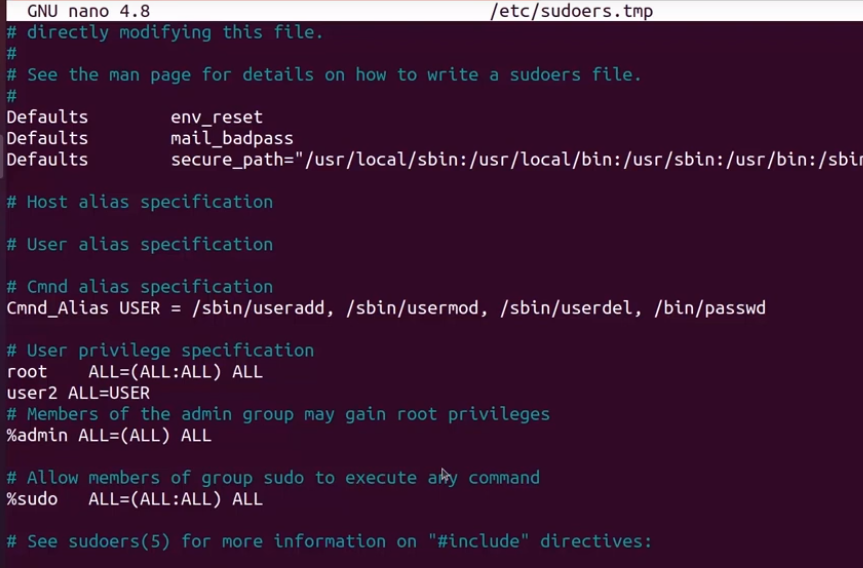
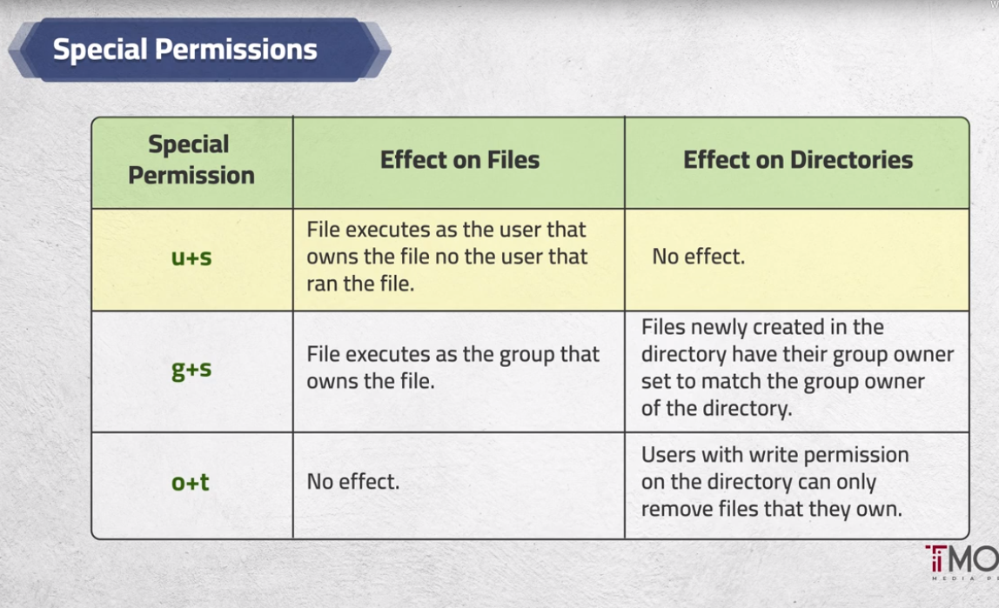
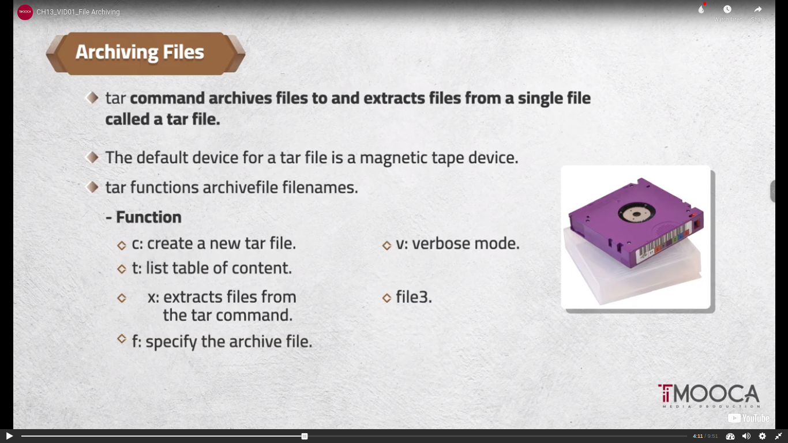
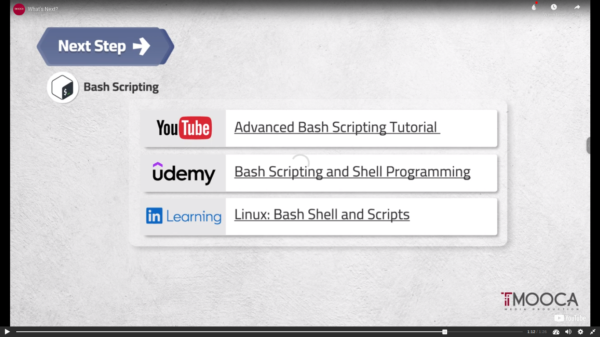
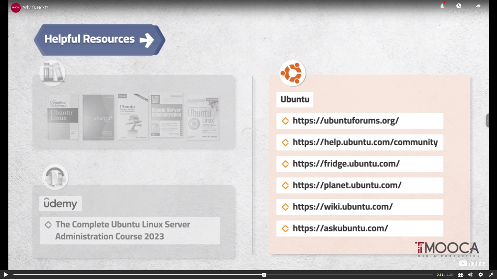
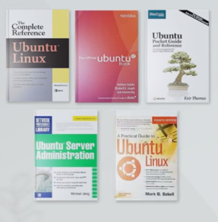
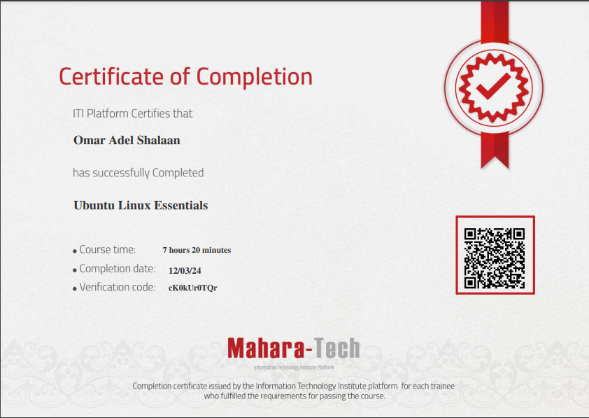

# Embedded Linux
## [My-Resume](https://github.com/OmarAdelShalaan/My-Resume) [Linkedin Profile](https://www.linkedin.com/in/omar-adel-shalaan/)

# Ubuntu_Linux_Essentials
## Mahara-Tech
([CH05_User and Group Administration](#ch05_user-and-group-administration)) ([CH06_File Ownership and Permissions](#CH06_File-Ownership-and-Permissions)) ([CH07_Shutting Down/Rebooting the System](#ch07_shutting-downrebooting-the-system)) ([CH08_Overview_ Network Configuration & Initialization Files](#ch08_overview_-network-configuration--initialization-files)) ([CH09_Processes, Priorities and Signals](#ch09_processes-priorities-and-signals)) ([CH10_Input-Output Redirection and Piping](#ch10_input-output-redirection-and-piping)) ([CH11_Sort and Compare Files](#ch11_sort-and-compare-files)) ([CH12_Inodes, Links, and Search for Files](#ch12_inodes-links-and-search-for-files)) ([CH13_Compress and Archive Files](#CH13_Compress-and-Archive-Files))
([Certification](#Certification))

## CH05_User and Group Administration
### VID04_Adding a New User Account
- sudo useradd user1
- tail -1 /etc/passwd
- tail -1 /etc/group
- sudo useradd -u 1005 -g user1 -c"user2 HR office 1010" -md /home/user2 -s /bin/bash user2
### VID05_Adding Password to User Accounts
- sudo passwd user1
- su - user2
- id
- exit
### VID06_Modifying User Accounts
- sudo usermod -aG secondaryGroup user2 (g: primary group, G: secondary group, a: add)
- userdel -r user2 (r: to delete user2 with home dir)
### VID07_Password Aging Policies
- chage [option] username
### VID08_Managing Groups
- groupadd groupName
- groupmod -n newGroupName oldGroupName
- groupdel groupName
- find /-nogroup
- gpasswd
### VID09_Changing Active Group
- chgrp otherGroup fileName
- newgrp groupName ; exit (to out from newgrp command)
- groups
### VID10_Switching Accounts
- su - user2 -c ls
### VID11_"sudo" Command
- /etc/sudoersin
- Cmnd_Alias USER = Commands
- user2 ALL=USER
  

## CH06_File Ownership and Permissions
### VID01_File Ownership
- chown user1 file1
- chown user1:group1 file1
- chown :group1 file1
### VID02_File Permissions
- chmod u+x file
- chmod 4775 file
### VID03_Changing the Permissions
- Symbolic Mode
  - Operator (+, -, =)
  - Permissions (r, w, x)
  - chmod u+x,go+r file
  - chmod ugo-x testFile
- Octal Mode
  - (owner (rwx)111, group (rwx)111, other (rwx)111) 777
  - chmod 777 file 
### VID04_Set UID Bit

### VID05_Set GID Bit
- 
### VID06_Sticky Bits
- Sticky Bits make available creation and prevent deletion
### VID07_The Default Permissions
- umask
- umask 000 (default)

## CH07_Shutting Down/Rebooting the System
### VID01_The Default PermissionsVirtual Consoles
- Ctrl + Alt + (F1 to F7)
### VID02_The Default PermissionsSystem Shutdown and Reboot
- shutdown
  - init 0
  - poweroff
  - shutdown -h time (Halt after shutdown)
  - shutdown -k now
- reboot
  - shutdown -r
  - reboot
  - init 6
  -  Ctrl + Alt + Del
 
## CH08_Overview_ Network Configuration & Initialization Files
### VID01_The Default PermissionsNetwork Configuration
- hostname
- /etc/host
- ls /sys/class/net
- ifconfig -a
### VID02_Shell Initialization Files
- .bashrc
- .profile
### VID03_Environment Variables
- PATH=$PATH:(add to path)
- (in .bashrc) PATH=$PATH:(add to path)
- PS1="$ "
### VID04_More about Environment Variables
- set
- env
- printenv $PATH
- $PWD
- $HOSTNAME
- $USERNAME
### VID05_Alias Command
- alias
- alias c=clear
- unalias c
- alias ls="ls -la"
- \ls or command with path to use the default command

## CH09_Processes, Priorities and Signals
### VID01_Processes
- ps -eo pid, ppid, ni, comm
### VID02_Change Process Priority
- nice 
- ps
- ps -f
- ps -l
- nice -n 10 bash
- renice 20 -p (PID)
### VID03_Overview of Signals
- top
- kill -STGTERM  (PID)
### VID04_Send a Signal to a Process
- kill [-signal] PIDs
- man -s7 signal
- sleep 20
- sleep 20 & ((to work in background))
- jobs
- kill -STOP %(JobID)
- fg %(JobID) (to work in frontground)
- bg %(JobID) (to work in background)
- pkill [-signal] process-name

## CH10_Input-Output Redirection and Piping
### VID01_Output Redirection
- > overwrite
- >> append 
- tr i I < file
- find
- mail < file (mail to users)
- ls -R / >op 2>error
### VID03_pipe & tee Commands
- tee
- ls | tee fileName |more

## CH11_Sort and Compare Files
### VID01_wc & diff Commands
- wc /etc/passwd
- wc -l /etc/passwd
- wc -w /etc/passwd
- wc -c /etc/passwd
- diff file1 file2
### VID02_cut & grep Commands
- cut -f1,6 -d: /etc/passwd
- grep -w user /etc/passwd
- grep ^user /etc/passwd
- grep -v user /etc/passwd
- grep -i user /etc/passwd
- grep -ic user /etc/passwd
- grep -il user /etc/passwd
### VID03_sort Command
- sort /etc/passwd
- sort -k 4 -t : /etc/passwd
- sort -k 4 -t : -n /etc/passwd

## CH12_Inodes, Links, and Search for Files  
### VID01_Inodes
- ls -i 
### VID02_Soft Link 
- ln -s file file-soft
### VID04_Search for files
- locate passwd (show system)
- find passwd (show from (.) now dir)

## CH13_Compress and Archive Files
### VID01_File Archiving

### VID02_File Compression

## After Course

## Resource

## Certification

