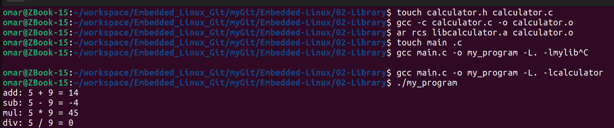
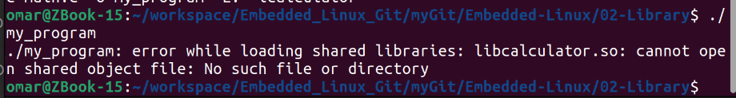
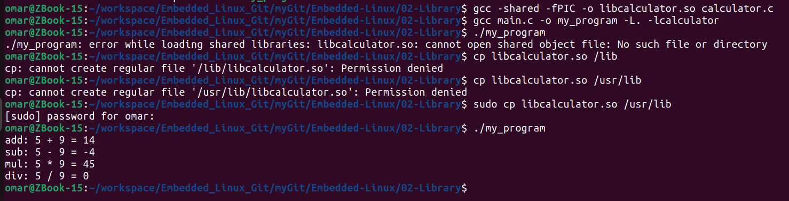
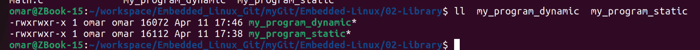

# Library

A library is a group of pre-compiled coded, called functions, to avoid repetition of code, package is created, called library.

Note: Library is not an executable.

## Static Library and Building Process

### Introduction

A **static library** is a collection of object files that are linked together during the compilation phase of a program. Unlike dynamic libraries, static libraries are linked with the program at compile time, resulting in a single executable file that contains the code from both the program and the library.

### Building a Static Library

#### 1. Write Your Code

Write the source code for your library. For example, let's create a simple library named `calculator` with a functions :

```c
#ifndef _CALCULATOR_H_
#define _CALCULATOR_H_

int add(int x, int y);
int sub(int x, int y);
int mul(int x, int y);
int div(int x, int y);

#endif
```

```c
#include "calculator.h"

int add(int x, int y)
{
	return x + y;
}
int sub(int x, int y)
{
	return x - y;
}
int mul(int x, int y)
{
	return x * y;
}
int div(int x, int y)
{
	return x / y;
}
```

#### 2. Compile the Source Files

Compile the source files (`calculator.c` in this case) into object files using a compiler like `gcc`:

```bash
gcc -c calculator.c -o calculator.o
```

#### 3. Create the Static Library

Use the `ar` (archiver) command to create the static library (`libcalculator.a`):

```bash
ar rcs libcalculator.a calculator.o
```

This command creates a static library (`libcalculator.a`) and adds the object file (`calculator.o`) to it.

#### 4. Use the Static Library in Your Program

Now, you can use the static library in your main program. Create a program (`main.c`) that includes the library header and calls the library function:

```c
#include <stdio.h>
#include "calculator.h"

int main() {
	int x = 5, y = 9;
	printf("add: %d + %d = %d\n", x, y, add(x, y));
	printf("sub: %d - %d = %d\n", x, y, sub(x, y));
	printf("mul: %d * %d = %d\n", x, y, mul(x, y));
	printf("div: %d / %d = %d\n", x, y, div(x, y));
	return 0;
}
```

#### 5. Compile Your Program with the Static Library

Compile your program with the static library:

```bash
gcc main.c -o my_program -L. -lcalculator
# OR
gcc main.c -o my_program -L. libcalculator
```

Here, `-L.` tells the linker to look for libraries in the current directory, and `-lcalculator` links your program with `libcalculator.a`.

#### 6. Run Your Program

Execute the compiled program:

```bash
./my_program
```



## Dynamic Library and Building Process

### Introduction

A **dynamic library** is a collection of compiled code that can be loaded into a program at runtime. Unlike static libraries, dynamic libraries are not embedded into the executable at compile time. Instead, they are linked at runtime, providing flexibility and modularity to the programs.

### Building a Dynamic Library

#### 1. Write Your Code

Similar to static libraries, write the source code for your library. For example, let's create a dynamic library named `calculator` with a functions:

```c
#ifndef _CALCULATOR_H_
#define _CALCULATOR_H_

int add(int x, int y);
int sub(int x, int y);
int mul(int x, int y);
int div(int x, int y);

#endif
```

```c
#include "calculator.h"

int add(int x, int y)
{
	return x + y;
}
int sub(int x, int y)
{
	return x - y;
}
int mul(int x, int y)
{
	return x * y;
}
int div(int x, int y)
{
	return x / y;
}
```

#### 2. Compile the Dynamic Library

Compile the source file into a shared object (dynamic library) using the `-shared` flag:

```bash
gcc -shared -fPIC -o libcalculator.so calculator.c
```

The `-shared` flag indicates that you are creating a shared object, and `-fPIC` generates position-independent code, which is necessary for shared libraries.

#### 3. Use the Dynamic Library in Your Program

Create a program (`main.c`) that includes the library header and calls the library function:

```c
#include <stdio.h>
#include "calculator.h"

int main() {
	int x = 5, y = 9;
	printf("add: %d + %d = %d\n", x, y, add(x, y));
	printf("sub: %d - %d = %d\n", x, y, sub(x, y));
	printf("mul: %d * %d = %d\n", x, y, mul(x, y));
	printf("div: %d / %d = %d\n", x, y, div(x, y));
	return 0;
}
```

#### 4. Compile Your Program with the Dynamic Library

Compile your program with the dynamic library:

```
gcc main.c -o my_program -L. -lcalculator
```

Here, `-L.` tells the linker to look for libraries in the current directory, and `-lcalculator` links your program with `libcalculator.so`.

#### Move OR Copy libcalculator.so to /usr/lib


#### 5. Run Your Program

Execute the compiled program:

```bash
./my_program
```



## The main difference between static and dynamic libraries

|    	       | static | dynamic    |
|--------------|:------:|-----------:|
| Static libraries are included in the program when it's created, so all the library's code is inside the final program | Dynamic libraries are not included in the executable during compilation. Instead, they are linked to the executable at runtime |
| Size      |  more |     less    |
| Portability      |  The executable can be moved to another system without worrying about library dependencies, as everything it needs is already included |     The dynamic library needs to be on the system where the program runs. If the required library version is missing, it can cause dependency problems.    |
| Loading      |  Since all code is included in the executable, there is no need for additional loading during runtime |     Dynamic libraries are loaded into memory by the operating system when the program starts or when the library is explicitly loaded during runtime    |





