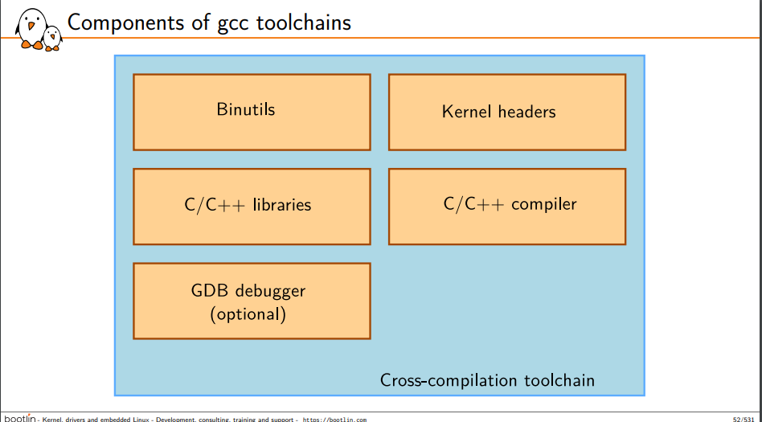
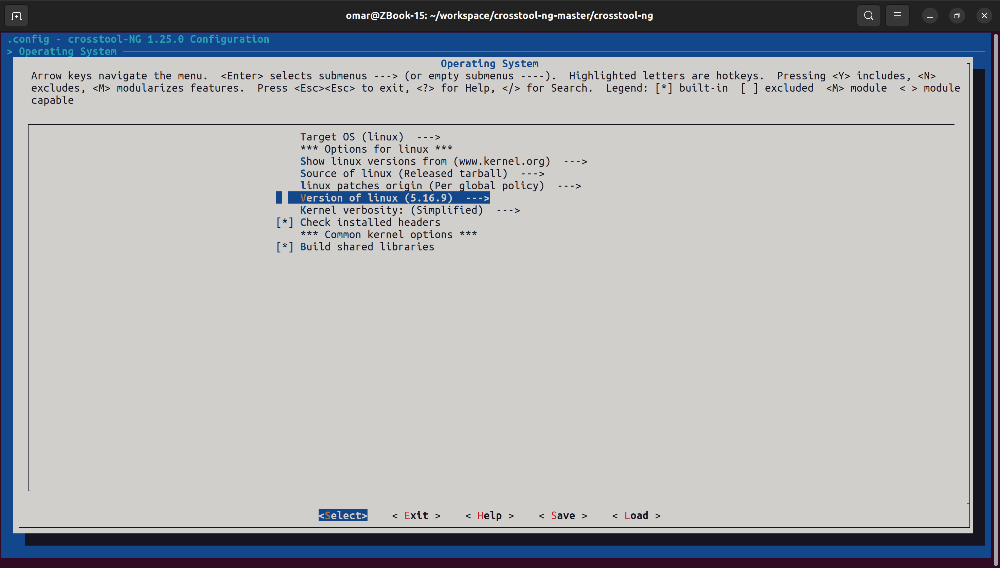

# toolchain
'''
A toolchain refers to a collection of software tools that are used to build and compile software for a specific target platform. This collection typically includes a compiler, linker, assembler, debugger, and other utilities necessary for software development. 
	
In the context of embedded systems and cross-compilation, a toolchain is crucial because it allows developers to compile code on one architecture (like a PC) for another architecture (like an ARM-based embedded device). This is often necessary in embedded systems development, where the target device may not have the resources or capabilities to compile software directly on itself.
'''

# Crosstool-NG
'''
Crosstool-NG is a popular open-source tool that helps in building cross-compilation toolchains. It's designed to simplify the process of creating toolchains for various target architectures, making it easier for developers working on embedded systems or cross-platform projects.
'''

### Crosstool-NG 
	$ git clone https://github.com/crosstool-ng/crosstool-ng.git
	$ cd crosstool-ng
	$ git checkout crosstool-ng-1.25.0
### Run bootstrap to setup the environment
	$ ./bootstrap
### Run configure to check all dependency
	$ ./configure --enable-local
### make to generate the Makefile for croostool-ng	
	$ make  
### ct-ng list-samples to list all microcontrollers supported
	./ct-ng list-samples | grep [microcontroller]
### ct-ng  to configure the microcontroller used
	./ct-ng [microcontroller]
### ct-ng menuconfig to configure toolchain
	./ct-ng menuconfig
### ct-ng build to build and get your toolchain
	./ct-ng build

### After build 
	~/x-tools/[microcontroller]/
	/home/omar/x-tools/arm-cortexa9_neon-linux-musleabihf

	
### Using the bin to compile 
	
