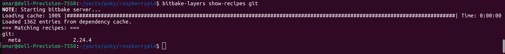
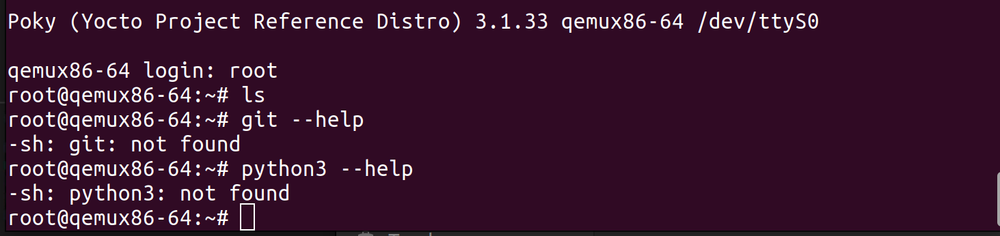
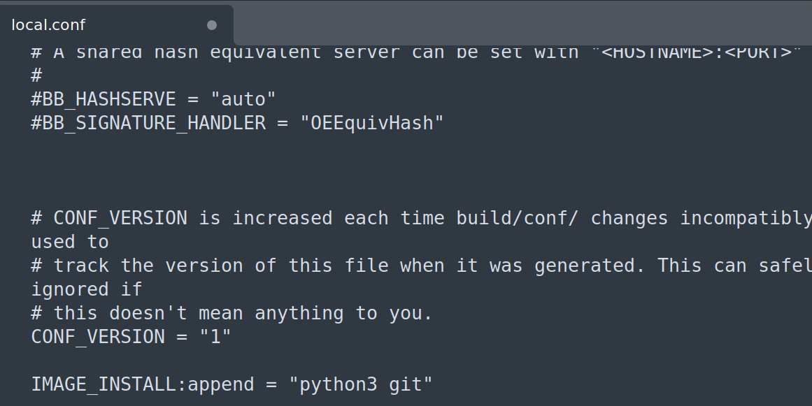
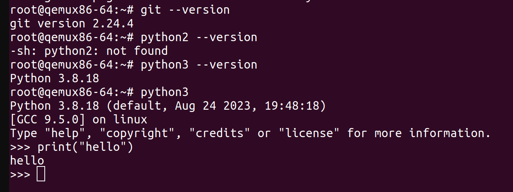

# Adding Packages

## show recipes
```bash
bitbake-layers show-recipes
```


## show spacific recipe  
```bash
bitbake-layers show-recipes python3
# OR
bitbake-layers show-recipes git
```


## in **local.conf**
```bash
IMAGE_INSTALL:append = "python3"
IMAGE_INSTALL:append = "git"
#OR
IMAGE_INSTALL:append = "python3 git"
```
### check git and python in qemux86-64 


### add IMAGE_INSTALL:append = "python3 git" in **local.conf**


### bitbake core-image-minimal


#
#
# Useful Tools and Packages to Yocto-based system on Raspberry Pi

To enhance the functionality and usability of your Yocto-based system on Raspberry Pi, you might consider adding the following useful tools and packages:

# Development Tools:
- Build Essentials: Includes essential build tools like make, gcc, and binutils.
- Git: Version control system for managing source code.
- CMake: Cross-platform build system generator.
**Example:**
```bash
IMAGE_INSTALL_append = " build-essential git cmake"
```
# System Utilities:
- htop: Interactive process viewer.
- nano or Vim: Lightweight text editors for configuration files.
- tmux or screen: Terminal multiplexers for managing multiple sessions.
**Example:**
```bash
IMAGE_INSTALL_append = " htop nano tmux"
```
# Networking Tools:
- Net-tools: Includes tools like ifconfig, netstat, and route.
- OpenSSL: Toolkit for SSL/TLS protocols and cryptography.
**Example:**
```bash
IMAGE_INSTALL_append = " net-tools openssl"
```
# Debugging and Profiling Tools:
- gdb: GNU Debugger for debugging programs.
- strace or ltrace: System call and library call tracing tools.
- valgrind: Memory debugging and profiling tool.
**Example:**
```bash
IMAGE_INSTALL_append = " gdb strace valgrind"
```
# Python Libraries and Tools:
- NumPy: Numerical computing library.
- Pandas: Data analysis library.
- Matplotlib: Plotting library.
**Example:**
```bash
IMAGE_INSTALL_append = " python3-numpy python3-pandas 
python3-matplotlib"
```
# Documentation Tools:
- Doxygen: Generates documentation from source code comments.
- Sphinx: Documentation generator for Python projects.
**Example:**
```bash
IMAGE_INSTALL_append = " doxygen python3-sphinx"
```
# Extra Utilities:
- curl: Command-line tool for transferring data.
- wget: Retrieves files from the web via HTTP, HTTPS
- zip and unzip: Compression and decompression utilities.
```bash
IMAGE_INSTALL_append = " curl wget zip unzip"
```
