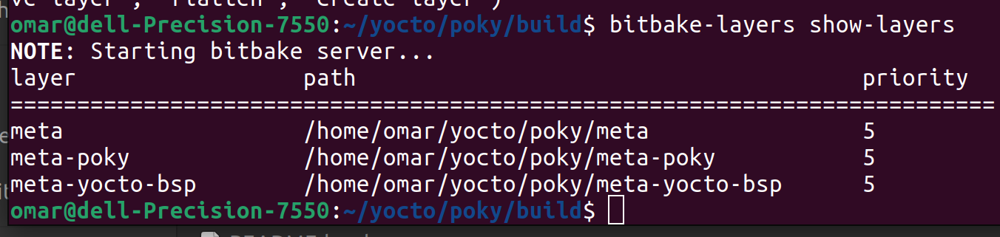
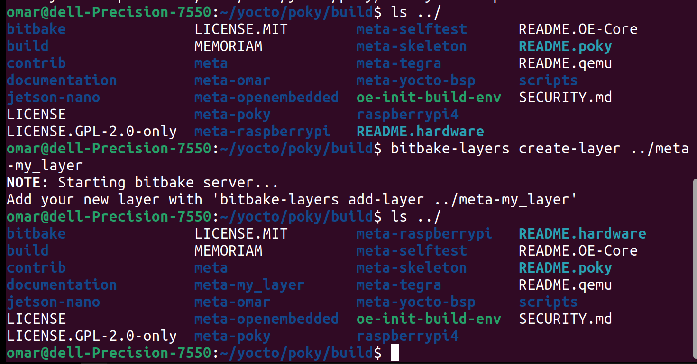
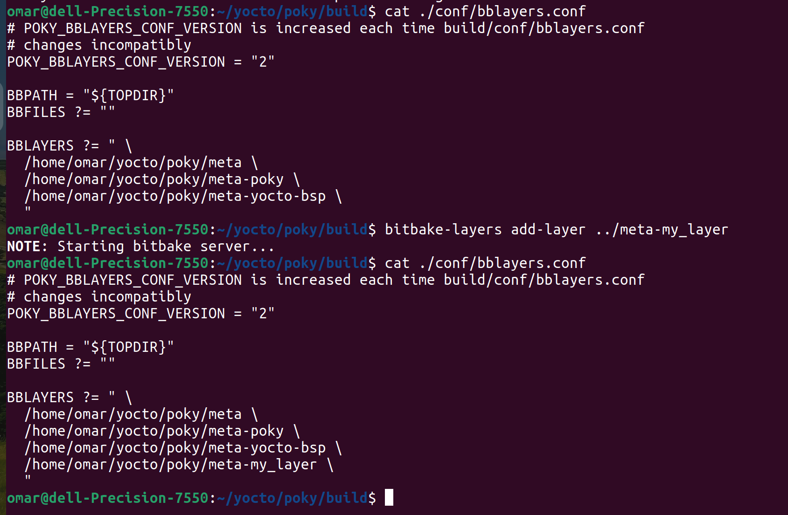
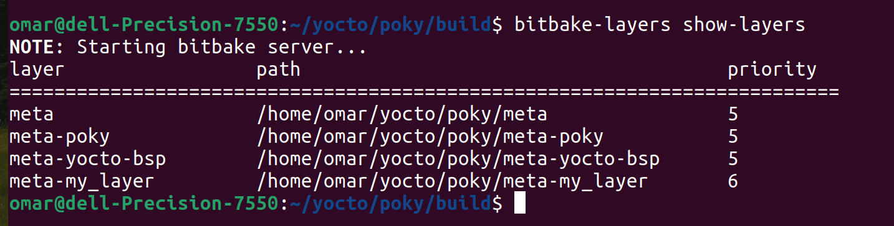

# Create and Add Layer with Yocto 

## show layer
```bash
$ bitbake-layers show-layers
```



## Create Layer
```bash
$ bitbake-layers create-layer ../meta-my_layer
```



## Add Layer
```bash
$ bitbake-layers add-layer ../meta-my_layer
```



## show layer
```bash
$ bitbake-layers show-layers
# OR
$ cat ./conf/bblayers.conf
```


