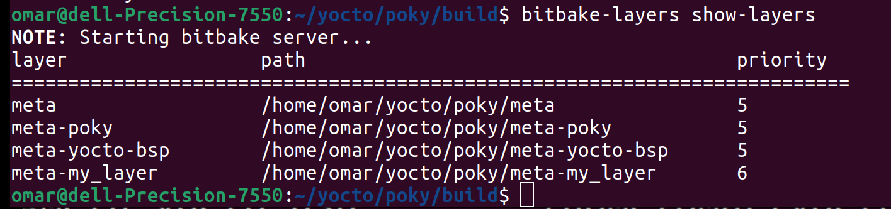
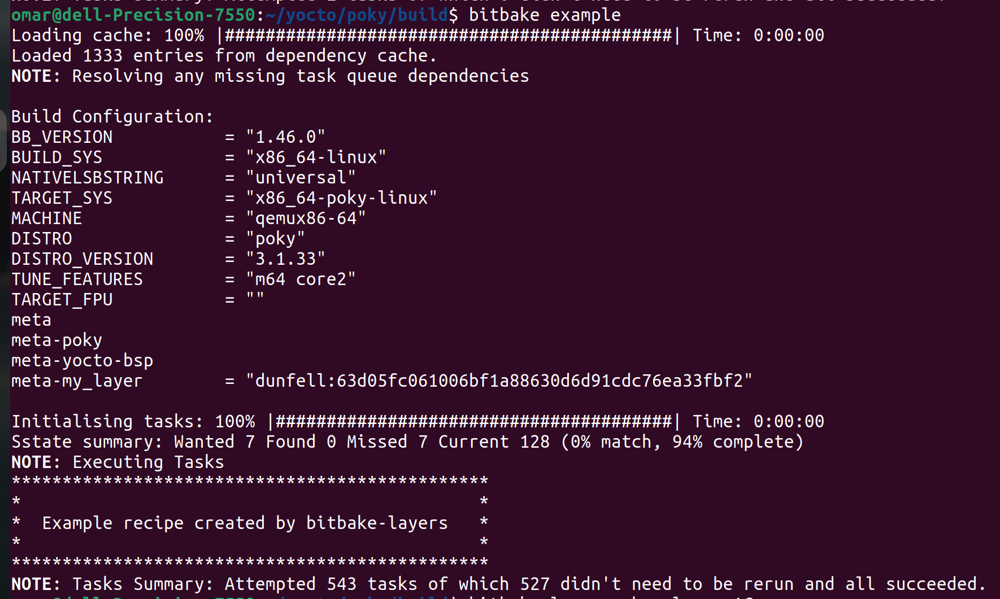

# Variable Assignment

## show-layers
```bash
$ bitbake-layers show-layers
```


##  Run example Recipe
```bash
$ bitbake example
```


## Delete example Recipe
```bash
$ bitbake example -c cleanall
```
After Add Layer
open layer.conf
```bash 
$ nano <PATH>/poky/meta-my_layer/conf/layer.conf
```

# Types of Variable Assignments
* **?=**   : This is used to assign the default value to varibale. It can be overridden.
* **??=** : This is used to assign the default value to varibale. But it is a weak assignment. It can be overridden. If multiple assignments are done with this type, the the last one will be considered.
* **=**   : This is a simple variable assignment. It requires " " and spaces are significant. But variables are expanded at the end.
* **:=** : This is an immediate variable expansion. The value assigned is expanded immediately.
* **+=** : This appends a value to a variable. The operator inserts **a space** between the current value and appended value. It takes effect immediately.
* **=+** : This prepends a value to a variable, The operator inserts **a space** between the current value and prepended value. It takes effect immediately.
* **.=** :  This appends a value to a variable. The operator inserts **no space** between the current value and appended value. It takes effect immediately.
* **=.** : This prepends a value to a variable. The operator inserts **no space** between the current value and prepended value. It takes effect immediately.
* **:append** :  This appends a value to a variable. The operator inserts **no space** between the current value and appended value.  The effects are applied at variable expansion time rather than being immediately applied.
* **:prepend** :  This appends a value to a variable. The operator inserts **no space** between the current value and appended value. The effects are applied at variable expansion time rather than being immediately applied.
* **:remove** : This remove values from lists. Specifying a value for removal causes all occurrences of that value to be removed from the variable.


-e, --environment   Show the global or per-recipe environment complete
                    with information about where variables were set/changed.


### Assignment Type ?= 

```bitbake
TEST ?= "Omar"
TEST ?= "Adel"
TEST ?= "Shalaan"

# The final value is TEST="Omar" 
```

### Assignment Type ??= 

```bitbake
TEST ??= "Omar"
TEST ??= "Adel"
TEST ??= "Shalaan"

# The final value is TEST="Shalaan" 
```

```bitbake
TEST ??= "Omar"
TEST  ?= "Adel"
TEST ??= "Shalaan"

# The final value is TEST="Adel" 
```

### Assignment Type = 

```bitbake
# Override
A ?= "Omar"
A = "Shalaan"

# The final value is A="Shalaan" 

# Variable Expansion
A = "Omar"
B = "${A}"
A = "Shalaan"

# The final value is B="Shalaan" 
```

### Assignment Type := 

```bitbake
# Override
A ?= "Omar"
A := "Shalaan"

# The final value is A="Shalaan" 

# Variable Expansion
A = "Omar"
B := "${A}"
A = "Shalaan"
# The final value is B="Omar" 
```

### Assignment Type +=  and =+

```bitbake
# Spaces are added here

# Append
A = "Omar"
A += "Shalaan"

# The final value is A="Omar Shalaan" 

# Prepend
B = "Omar"
B =+ "Shalaan"

# The final value is B="Shalaan Omar"

# Append
A ?= "Omar"
A += "Shalaan"

# The final value is A="Shalaan"

# Prepend
B ??= "Omar"
B =+ "Shalaan"

# The final value is B="Shalaan"
```

### Assignment Type .=  and =.

```bitbake
# No Spaces are added here
# Needs to add extra space

# Append
A = "Omar"
A .= "Shalaan"

# The final value is A="OmarShalaan" 

# Prepend
B = "Omar"
B =. "Shalaan"

# The final value is B="ShalaanOmar"
```

### Assignment Type :append, :prepend and :remove

```bitbake
# No Spaces are added here
# Needs to add extra space
# Parsed at the end

# Append
A = "Omar"
A:append = "Shalaan"
# The final value is A="OmarShalaan" 

# Append
A = "Omar"
A:append = "Adel"
A += "Shalaan"
# The final value is A="Omar ShalaanAdel" 

# Append
A = "Omar"
A:append = " Shalaan"
# The final value is A="Omar Shalaan" 


# Prepend
A = "Omar"
A:prepend = "Shalaan"
# The final value is A="ShalaanOmar" 

# Prepend
A = "Omar"
A:prepend = "Adel"
A =+ "Shalaan"
# The final value is A="AdelShalaan Omar" 

# Prepend
A = "Omar"
A:prepend = "Shalaan "
# The final value is A="Shalaan Omar" 

#remove

A = "Omar Adel"
A:remove = "Omar"
# The final value is A=" Adel" 

A = "Omar Adel"
A:remove = "Shalaan"
A += "Shalaan"
# The final value is A=" Omar Adel Shalaan" 
```


### Reference Link

https://docs.yoctoproject.org/bitbake/2.2/bitbake-user-manual/bitbake-user-manual-metadata.html

## Show Specific Variable (VarName)
```bash
bitbake -e example | grep ^VarName=
#-e, --environment       Show the global or per-recipe environment complete
#                        with information about where variables were
#                        set/changed.

```