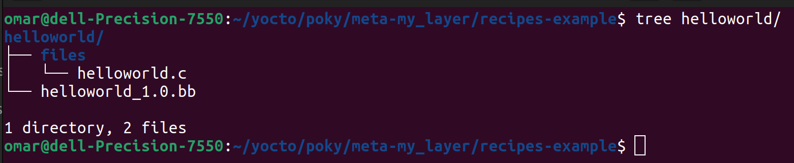
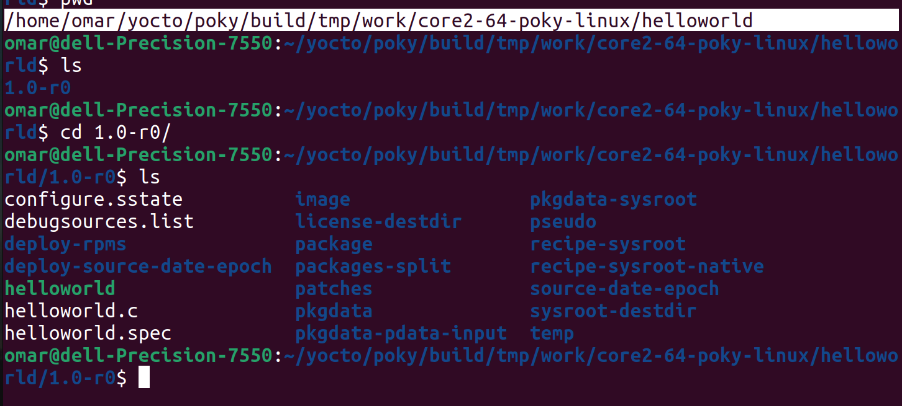
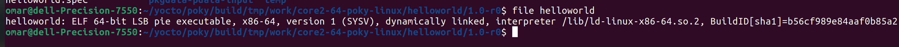

# Create Yocto Recipe

After Create and Add my_Layer to **local.conf**

# Create Recipe Dir
```bash
mkdir <PATH>/poky/meta-my_layer/recipes-example/helloworld
mkdir files
touch helloworld_1.0.bb files/helloworld.c
```


### helloworld.c
```c
#include <stdio.h>

int main()
{   
    printf("****************\n");
    printf("* Hello, World *\n");
    printf("****************\n");
    return 0;
}

```
### helloworld_1.0.bb
```python
SUMMARY = "bitbake-layers Hello World recipe"
DESCRIPTION = "Recipe created by me to print hello world bitbake-layers"
LICENSE = "MIT"

SRC_URI = "file://helloworld.c"

# Source
S = "${WORKDIR}"

LIC_FILES_CHKSUM = "file://${COMMON_LICENSE_DIR}/MIT;md5=0835ade698e0bcf8506ecda2f7b4f302"

do_compile() {
    ${CC} ${CFLAGS} ${LDFLAGS} ${WORKDIR}/helloworld.c -o ${S}/helloworld
}

do_install() {
    install -d ${D}${bindir}
    install -m 0755 ${S}/helloworld ${D}${bindir}/
}

```
### Add Recipe
```bash
$ source oe-init-build-env
$ bitbake helloworld
```
### Recipe PATH
```bash
<PATH>/poky/build/tmp/work/core2-64-poky-linux/helloworld
```


### file helloworld



### 1.SUMMARY and DESCRIPTION:
- **SUMMARY:** A brief one-line description of the recipe.
- **DESCRIPTION:** A more detailed description of what the recipe does.
### 2.LICENSE and LIC_FILES_CHKSUM:
- **LICENSE:** Specifies the license under which the recipe and associated files are distributed. In this case, it's MIT.
- **LIC_FILES_CHKSUM:** Checks the integrity of the license file specified (${COMMON_LICENSE_DIR}/MIT). The md5 checksum ensures that the license file hasn't been tampered with.
### 3.SRC_URI and Source Directory (S):
- **SRC_URI:** Specifies the source file(s) needed for the recipe. Here, you're using a local file (file://helloworld.c).
- **S:** Points to the directory where the source code will be extracted (${WORKDIR}). This variable is often used in BitBake recipes to refer to the source directory.
### 4.do_compile():
This function is responsible for compiling your source code.
- **${CC}:** Refers to the compiler specified by BitBake.
- **${CFLAGS} and ${LDFLAGS}:** Compiler and linker flags, which can be set in your environment or in the recipe.
- **${WORKDIR}/helloworld.c:** Path to the source file within the source directory.
- **-o ${S}/helloworld:** Specifies the output executable name and location.
### 5.do_install():
This function handles the installation of the compiled binary.
- **install -d ${D}${bindir}:** Creates the destination directory ${D}${bindir} if it doesn't exist.
- install -m 0755 ${S}/helloworld ${D}${bindir}/: Installs the helloworld binary with appropriate permissions (0755) into the destination directory ${D}${bindir}/.