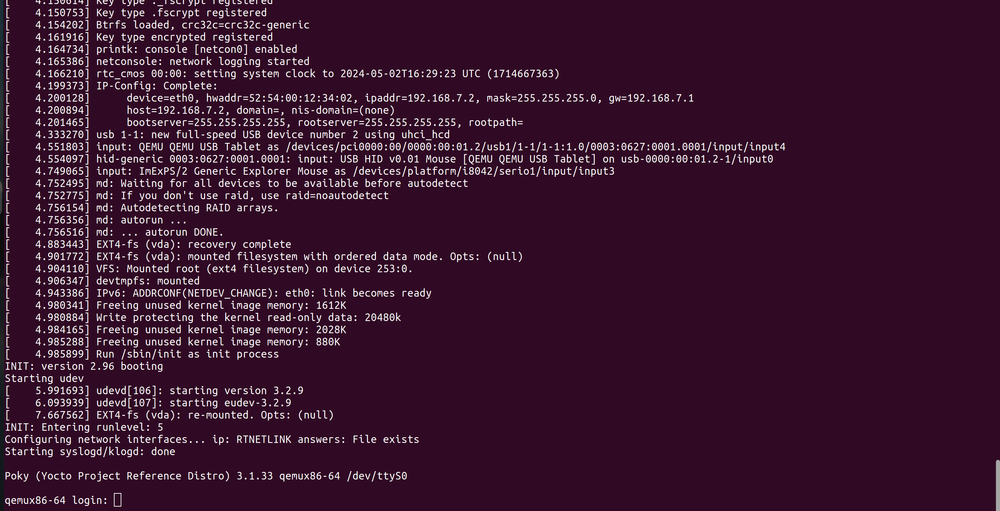
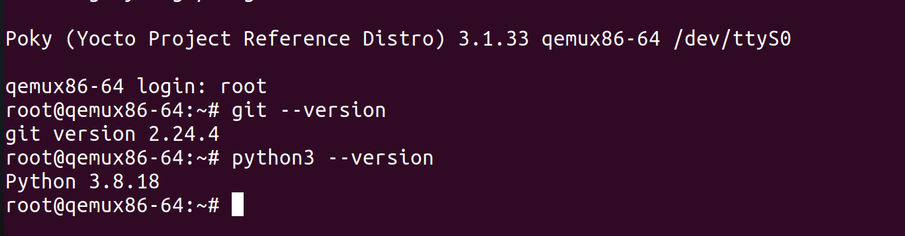

# The qemux86-64 Yocto Image

# Create Build Dir

```bash
$ source oe-init-build-env 
```
that will create build Dir, build image will be in it


### Machine  in local.conf
```bash
MACHINE ??= "qemux86-64"
```

### Add Layers in bblayers.conf

```bash
BBLAYERS ?= " \
  /home/omar/yocto/poky/meta \
  /home/omar/yocto/poky/meta-poky \
  /home/omar/yocto/poky/meta-yocto-bsp \
  "
```

### Add Packages in local.conf
```bash
IMAGE_INSTALL:append = "python3 git"
```

### Build Image

```bash
$ bitbake core-image-minimal
```

## run qemu
```bash
$ runqemu qemux86-64 nographic
```





