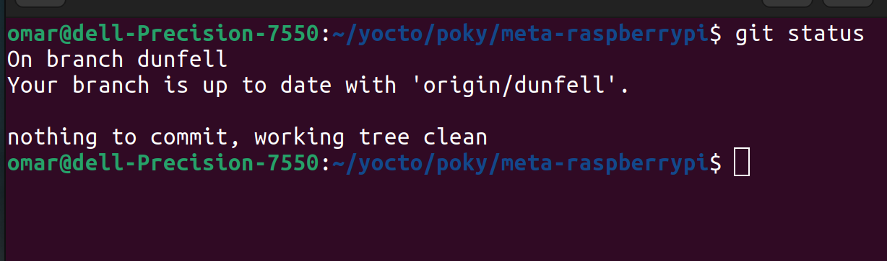
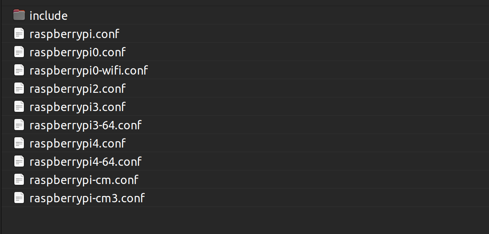
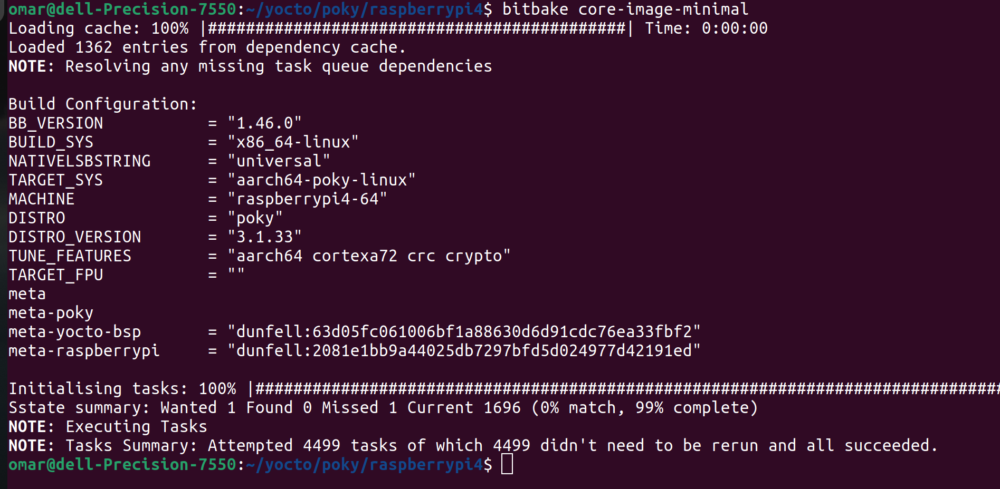

# The Raspberry Pi Yocto Image

# Create Raspberry Pi Build Dir

```bash
$ source oe-init-build-env raspberrypi4/
```

# meta-raspberrypi
get meta-raspberrypi layer to poky

```bash
$ git clone  -b dunfell git://git.yoctoproject.org/meta-raspberrypi 
```



## Choose Machine
```bash
$ ls <PATH>/poky/meta-raspberrypi/conf/machine
```


### Add Machine in local.conf
```bash
MACHINE ??= "raspberrypi4-64" 
```

### Add Layers in bblayers.conf

```bash
BBLAYERS ?= " \
  /home/omar/yocto/poky/meta \
  /home/omar/yocto/poky/meta-poky \
  /home/omar/yocto/poky/meta-yocto-bsp \
  /home/omar/yocto/poky/meta-raspberrypi \
  "
```

### Add Packages in local.conf
```bash
IMAGE_INSTALL_append = " git cmake"
IMAGE_INSTALL_append = " net-tools openssl"
IMAGE_INSTALL_append = " gdb strace "
IMAGE_INSTALL_append = " python3"
IMAGE_INSTALL_append = " curl wget zip unzip"
IMAGE_INSTALL_append = " vim"
```

### Build Image

```bash
$ bitbake core-image-minimal
```


### [Image](https://drive.google.com/file/d/1V4vCq0w_pcomDRAJESQHTt69k6s-yLjZ/view?usp=sharing)


