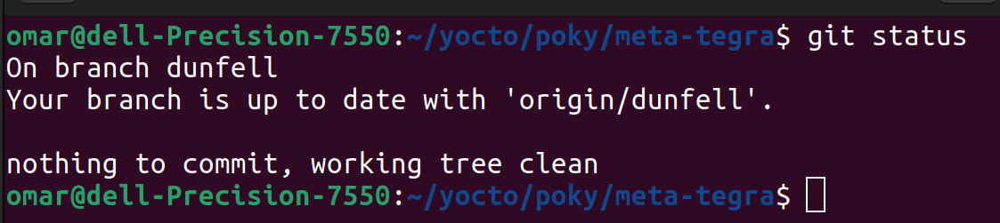
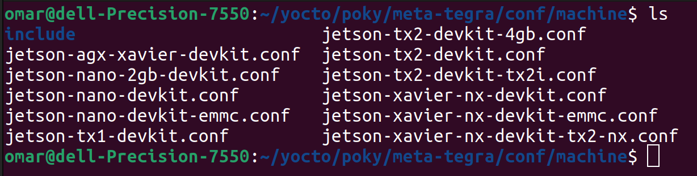
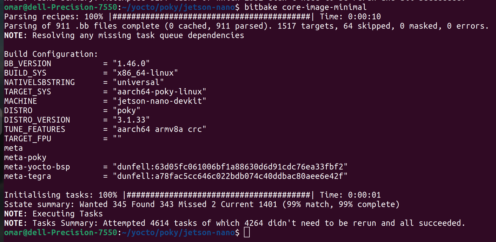
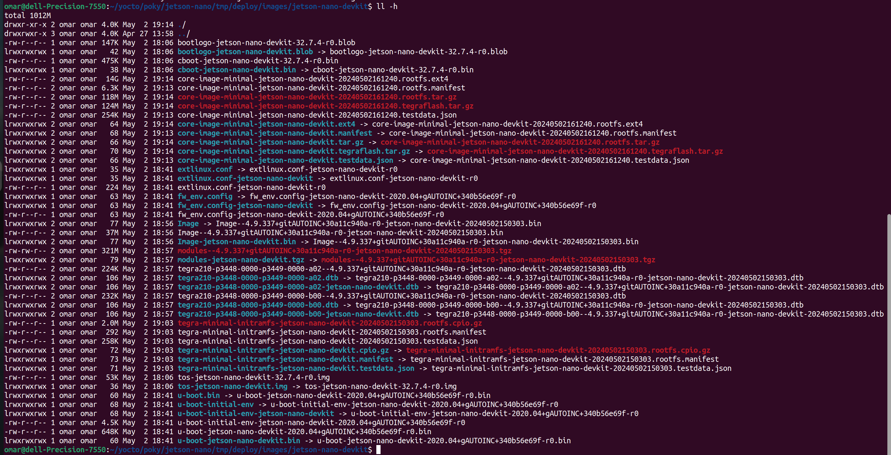

# The Jetson Dev Kit Yocto Image

# Create jetson-nano Build Dir

```bash
$ source oe-init-build-env jetson-nano/
```

# meta-tegra
get meta-tegra layer to poky
```bash
$ git clone  -b dunfell https://github.com/OE4T/meta-tegra 
```



## Choose Machine
```bash
$ ls <PATH>/poky/meta-tegra/conf/machine
```


### Add Machine in local.conf
```bash
MACHINE ?= "jetson-nano-devkit"

IMAGE_CLASSES += "image_types_tegra"
IMAGE_FSTYPES = "tegraflash tar.gz"

BB_NUMBER_THREADS = '4'
PARALLEL_MAKE = '-j4'
```

### Add Layers in bblayers.conf
```bash
BBLAYERS ?= " \
  /home/omar/yocto/poky/meta \
  /home/omar/yocto/poky/meta-poky \
  /home/omar/yocto/poky/meta-yocto-bsp \
  /home/omar/yocto/poky/meta-tegra  \
  "
```
### Add Packages in local.conf
```bash
IMAGE_INSTALL_append = " git cmake"
IMAGE_INSTALL_append = " net-tools openssl"
IMAGE_INSTALL_append = " gdb strace "
IMAGE_INSTALL_append = " python3"
IMAGE_INSTALL_append = " curl wget zip unzip"
IMAGE_INSTALL_append = " vim"
```

### Build Image

```bash
$ bitbake core-image-minimal
```



### [Image](https://drive.google.com/file/d/17k17zc1neGpLubx36K-3aJpiZZwrTem7/view?usp=sharing)
### [Image](https://drive.google.com/file/d/17QFVisGBHxF3XZkkHXv5RJL7mdpoHNzQ/view?usp=sharing)



