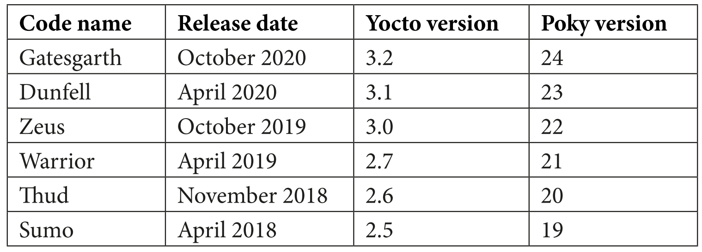

# Mastering Embedded Linux Programming 3rd Book

# Introducing the Yocto Project
```
The Yocto Project is a more complex beast than Buildroot. Not only can it build toolchains,
bootloaders, kernels, and root filesystems as Buildroot can, but it can generate an entire
Linux distribution for you with binary packages that can be installed at runtime. The build
process is structured around groups of recipes, similar to Buildroot packages but written
using a combination of Python and shell script. The Yocto Project includes a task scheduler
called BitBake that produces whatever you have configured, from the recipes.
```
## the Yocto Project collects several components, the most important of which are
- **OE-Core:** This is the core metadata, and is shared with OpenEmbedded.
- **BitBake:** This is the task scheduler, and is shared with OpenEmbedded and other projects.
- **Poky:** This is the reference distribution.
- **Documentation:** This is the user's manuals and developer's guides for each component.
- **Toaster:** This is a web-based interface to BitBake and its metadata.

## Stable releases and supports
Usually, there is a release of the Yocto Project every 6 months: in April and October.


## Installing the Yocto Project
To get a copy of the Yocto Project, clone the repository, choosing the code name as the
branch, which is dunfell in this case:
```
$ git clone -b dunfell git://git.yoctoproject.org/poky.git
```
This creates a working directory for you named **build/** and makes it the current directory. All of the configuration, as well as any intermediate and target image files,will be put in this directory.
You must **source this script** each time you want to work on this project


## Build for the QEMU Arm emulator. 
Begin by sourcing a script to set up the environment:
```
$ source poky/oe-init-build-env
```
### choose a different working directory 
by adding it as a parameter to oe-init-build-env; for example:
```
$ source poky/oe-init-build-env build-qemuarm
```
### the build directory contains only one subdirectory named **conf/**, which
contains the following **configuration** files for this project:
- **local.conf:** This contains a specification of the device you are going to build and the build environment.
- **bblayers.conf:** This contains the paths of the meta layers you are going to use. I will describe layers later on

## Building
To actually perform the build, you need to **run BitBake**, telling it which root filesystem image you want to create. Some common images are as follows:
- **core-image-minimal:** This is a small console-based system that is useful for tests and as the basis for custom images.
- **core-image-minimal-initramfs:** This is similar to core-imageminimal but built as a ramdisk.
- **core-image-x11:** This is a basic image with support for graphics through an X11 server and the xterminal Terminal app.
- **core-image-full-cmdline:** This console-based system offers a standard CLI experience and full support for the target hardware.

By giving BitBake the final target, it will work backward and build all the dependencies first, beginning with the toolchain. For now, we just want to create a minimal image to see
how it works:
```
$ bitbake core-image-minimal
```
When it is complete, you will find several new directories in the build directory, including **downloads/**, which contains all the source downloaded for the build, and **tmp/**, which contains most of the build artifacts. You

#### should see the following in tmp/:
- **work/:** This contains the build directory and the staging area for the root filesystem.
- **deploy/:** This contains the final binaries to be deployed on the target:
    - **deploy/images/[machine name]/:** Contains the bootloader, the kernel and the root filesystem images ready to be run on the target.
    - **deploy/rpm/:** This contains the RPM packages that make up the images.
    - **deploy/licenses/:** This contains the license files that are extracted from each package

## Running the QEMU target
```
$ runqemu qemuarm
$ runqemu qemuarm nographic
```
##### In this case, close QEMU using the key sequence Ctrl + A and then x

## Layers
The metadata for the Yocto Project is structured into layers. By convention, each layer has a name beginning with meta. The core layers of the Yocto Project are as follows:
- **meta:** This is the OpenEmbedded core and contains some changes for Poky.
- **meta-poky:** This is the metadata specific to the Poky distribution.
- **meta-yocto-bsp:** This contains the board support packages for the machines that the Yocto Project supports.

The list of layers in which BitBake searches for recipes is stored in your "**build"directory/conf/bblayers.conf** and, by default, includes all three layers mentioned in the preceding list.

### Extend the Yocto Project
it is very easy to extend the Yocto Project by adding new layers. Additional layers are available from SoC manufacturers, the Yocto Project itself, and a wide range of people wishing to add value to the Yocto Project and OpenEmbedded. There is a useful list of layers at http://layers.openembedded.org/layerindex/.
**Here are some examples:**
  - **meta-qt5:** Qt 5 libraries and utilities
  - **meta-intel:** BSPs for Intel CPUs and SoCs
  - **meta-raspberrypi:** BSPs for the Raspberry Pi boards
  - **meta-ti:** BSPs for TI Arm-based SoCs

### Create a Layer
Each meta layer has to have at least one configuration file, named conf/layer.conf, and it should also have the README file and a license.

To create our meta-nova layer, perform the following steps:
```
$ source poky/oe-init-build-env build-nova
$ bitbake-layers create-layer nova
$ mv nova ../meta-nova
```
This will put you in a working directory named build-nova and create a layer named **meta-nova** with a **conf/layer.conf**, an outline README, and an MIT LICENSE in COPYING.MIT. The layer.conf file looks like this:
```
# We have a conf and classes directory, add to BBPATH
BBPATH .= ":${LAYERDIR}"
# We have recipes-* directories, add to BBFILES
BBFILES += "${LAYERDIR}/recipes-*/*/*.bb \
 ${LAYERDIR}/recipes-*/*/*.bbappend"
BBFILE_COLLECTIONS += "nova"
BBFILE_PATTERN_nova = "^${LAYERDIR}/"
BBFILE_PRIORITY_nova = "6"
LAYERDEPENDS_nova = "core"
LAYERSERIES_COMPAT_nova = "dunfell"
```
It adds itself to BBPATH and the recipes it contains to BBFILES
This layer has the name nova, was added to the list of layers in BBFILE_COLLECTIONS, and has a priority of 6. 
The layer's priority is used if the same recipe appears in several layers:
the one in the layer with the highest priority wins.

Now,**add this layer to your build configuration** using the following command:
```
$ bitbake-layers add-layer ../meta-nova
```
Make sure to run this command from your build-nova working directory after sourcing that environment.
You can confirm that your layer structure is set up correctly like this:
```
$ bitbake-layers show-layers
NOTE: Starting bitbake server...
layer path priority
==============================================================
meta            /home/frank/poky/meta           5
meta-poky       /home/frank/poky/meta-poky      5
meta-yocto-bsp  /home/frank/poky/meta-yocto-bsp 5
meta-nova       /home/frank/meta-nova           6
```
## BitBake and recipes
- **Recipes:** Files ending in .bb. These contain information about building a unit of software, including how to get a copy of the source code, the dependencies of other components, and how to build and install it.
- **Append:** Files ending in .bbappend. These allow some details of a recipe to be overridden or extended. A bbappend file simply appends its instructions to the end of a recipe (.bb) file of the same root name.
- **Include:** Files ending in .inc. These contain information that is common to several recipes, allowing information to be shared among them. The files may be included using the include or require keywords. The difference is that require produces an error if the file does not exist, whereas include does not.
- **Classes:** Files ending in .bbclass. These contain common build information; for example, how to build a kernel or how to build an autotools project. The classes are inherited and extended in recipes and other classes using the inherit keyword. The classes/base.bbclass class is implicitly inherited in every recipe.
- **Configuration:** Files ending in .conf. They define various configuration variables that govern the project's build process.

## Recipe
A recipe is a collection of tasks written in a combination of Python and shell script. The tasks have names such as do_fetch, do_unpack, do_patch, do_configure, do_ compile, and do_install.
You **use BitBake to execute** these tasks. The default task is do_build, which performs all the subtasks required to build the recipe

list the tasks available in a recipe using bitbake -c listtasks [recipe].
- For example,
  - list the tasks in core-image-minimal like this:
  ```bash
  $ bitbake -c listtasks core-image-minimal
  ```
```
Important note
The -c option tells BitBake to run a specific task from a recipe without having
to include the do_ part at the beginning of the task's name.
```

#### To get the code for a target and all its dependencies,
```bash
$ bitbake core-image-minimal --runall=fetch
```


## 7 Developing with Yocto
```
Yocto
provides **Board Support Packages (BSPs)**" to bootstrap embedded Linux development
on popular single-board computers such as the BeagleBone Black and Raspberry Pi 4.
```
### In this chapter, we will cover the following topics:
- Building on top of an existing BSP
- Capturing changes with devtool
- Building your own distro
- Provisioning a remote package server

## create a recipe