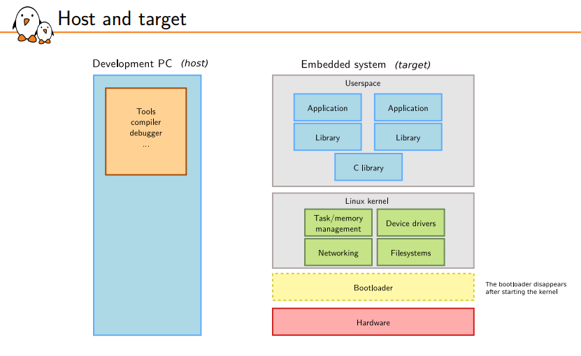
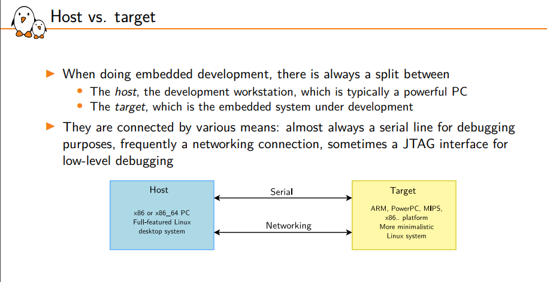
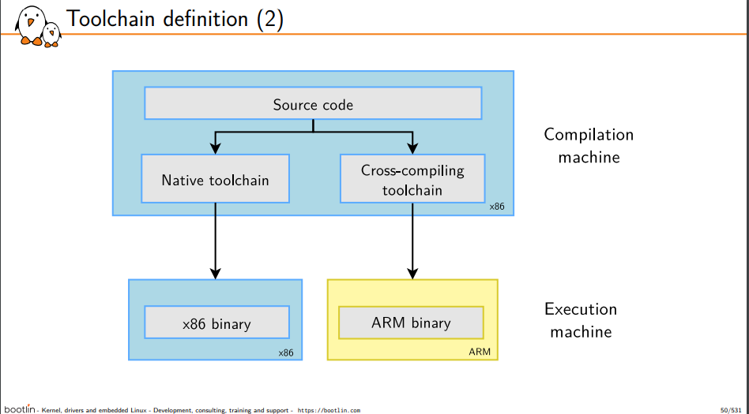
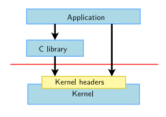
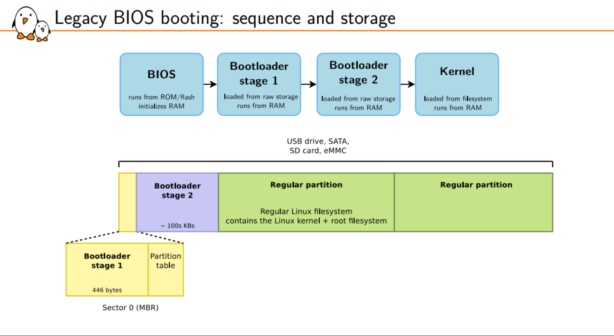
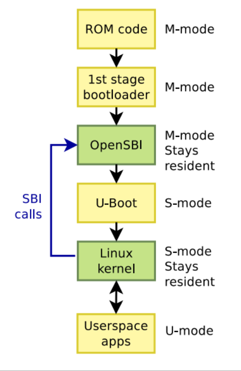
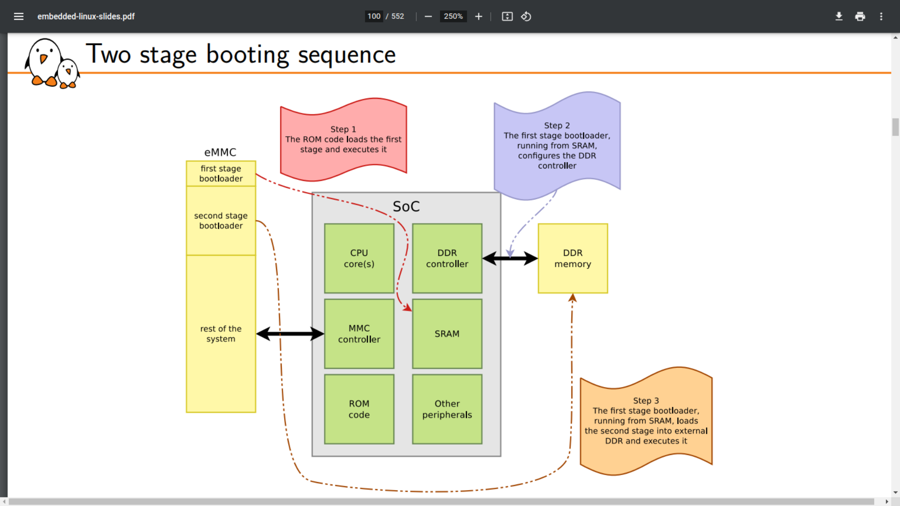
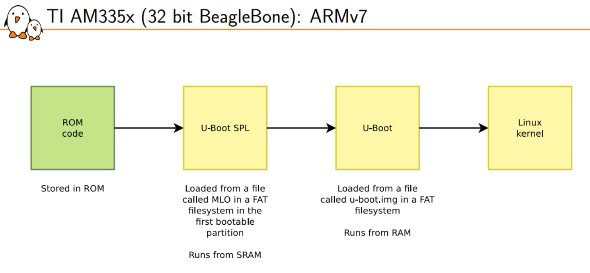
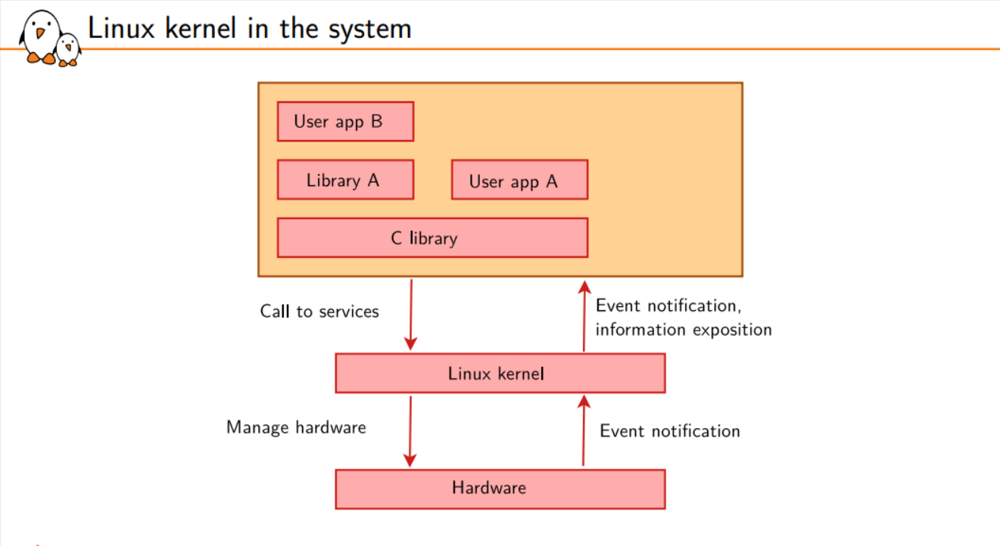
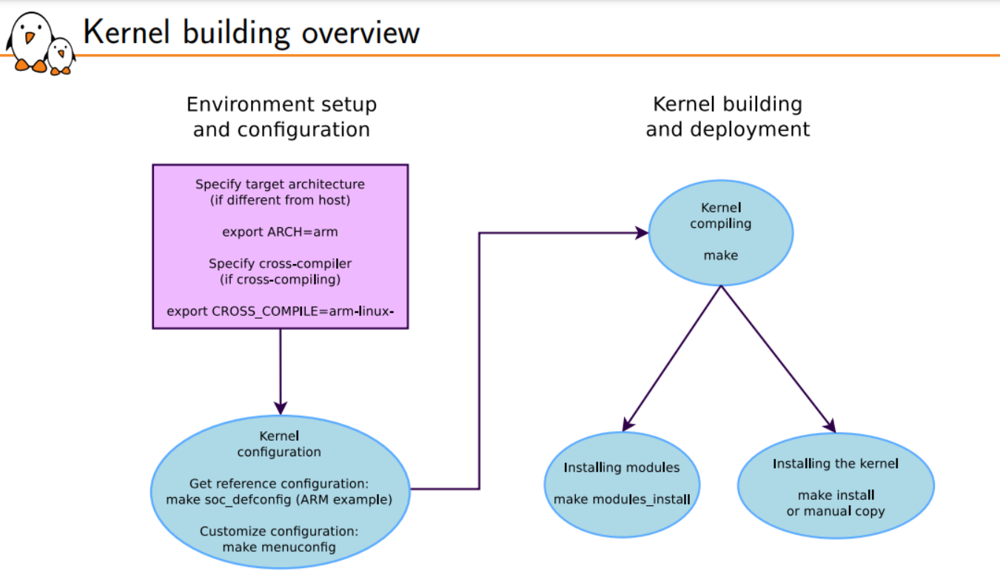

# Processor and architecture
- the bootloader and the kernel, all other components are generally architecture-independent
# RAM and storage
- RAM: a very basic Linux system can work within 8 MB of RAM, but a more realistic system will usually require at least 32 MB of RAM. Depends on the type and size of applications.
- Storage: a very basic Linux system can work within 4 MB of storage, but usually more is needed.
# Communication
- The Linux kernel has support for many common communication buses
        - I2C
        - SPI
        - 1-wire
        - SDIO
        - PCI
        - USB
        - CAN (mainly used in automotive)
- And also extensive networking support
        - Ethernet, Wifi, Bluetooth, CAN, etc.
        - IPv4, IPv6, TCP, UDP, SCTP, DCCP, etc.
        - Firewalling, advanced routing, multicast
# Host and target

# Embedded Linux solutions
-  MontaVista, Wind River or TimeSys.
# Host vs. target
  

# Serial line communication program
- Minicom, Picocom, Gtkterm, Putty, screen, tmux and the new tio

# Toolchain definition
- native toolchain: runs on your workstation and generates code for your workstation, usually x86
- cross-compiling toolchains are generally used. They run on your workstation but generate code for your target.

# Architecture tuple and toolchain prefix
- Many UNIX/Linux build mechanisms rely on architecture tuple names to identify machines.
- Examples: arm-linux-gnueabihf, mips64el-linux-gnu, arm-vendor-none-eabihf
- These tuples are 3 or 4 parts:
        1. The architecture name: arm, riscv, mips64el, etc.
        2. Optionally, a vendor name, which is a free-form string
        3. An operating system name, or none when not targeting an operating system
        4. The ABI/C library (see later)
- This tuple is used to:
        • configure/build software for a given platform
        • as a prefix of cross-compilation tools, to differentiate them from the native toolchain
        gcc → native compiler
        arm-linux-gnueabihf-gcc → cross-compiler

# Components of gcc toolchains

# Binutils
- Binutils: is a set of tools to generate and manipulate binaries (usually with the ELF format) for a given CPU architecture
• as, the assembler, that generates binary code from assembler source code
• ld, the linker
• ar, ranlib, to generate .a archives (static libraries)
• objdump, readelf, size, nm, strings, to inspect binaries. Very useful analysis tools!
• objcopy, to modify binaries
• strip, to strip parts of binaries that are just needed for debugging (reducing their
size).

# Kernel headers (1)
- The C standard library and compiled programs need to interact with the kernel
        • Available system calls and their numbers
        • Constant definitions
        • Data structures, etc.
- Therefore, compiling the C standard library requires kernel headers, and many applications also require them.

# Kernel headers (3)
- Hence, binaries generated with a toolchain using kernel headers older than the running kernel will work without problem, but won’t be able to use the new system calls, data structures, etc.
- Binaries generated with a toolchain using kernel headers newer than the running kernel might work only if they don’t use the recent features, otherwise they will break.

# Linux vs. bare-metal toolchain
- A Linux toolchain is a toolchain that includes a Linux-ready C standard library, which uses the Linux system calls to implement system services
        - can be used to build Linux user-space applications, but also bare-metal code (firmware, bootloader, Linux kernel)
        - is identified by the linux OS identifier in the toolchain tuple: arm-linux, arm-none-linux-gnueabihf
- A bare metal toolchain
        - is a toolchain that does not include a C standard library, or a very minimal one that isn’t tied to a particular operating system
        - can be used to build only bare-metal code (firmware, bootloader, Linux kernel) is identified by the none OS identifier in the toolchain tuple: arm-none-eabi, arm-none-none-eabi (vendor is none, OS is none)

# Toolchain building utilities (3)
- Buildroot
        - Makefile-based. Can build glibc, uClibc and musl based toolchains, for a wide range of architectures. Use make sdk to only generate a toolchain.
- OpenEmbedded / Yocto Project
        - A featureful, but more complicated build system, supporting only glibc and musl.

# Bootloader role
- The bootloader is a piece of code responsible for
	- Basic hardware initialization
	- Loading of an application binary, usually an operating system kernel, from flash storage, from the network, or from another type of non-volatile storage.
	- Possibly decompression of the application binary
	- Execution of the application
- Besides these basic functions, most bootloaders provide a shell or menu
	- Menu to select the operating system to load
	- Shell with commands to load data from storage or network, inspect memory, perform hardware testing/diagnostics

# UEFI booting
- Starting from 2005-2006, UEFI is the new firmware interface on x86 platforms
	- Unified Extensible Firmware Interface
	- Describes the interface between the operating system and the firmware
	- Firmware in charge of booting
	- Firmware also provides runtime services to the operating system
	- Stored in some flash memory, outside of regular user-accessible storage devices
- Loads EFI binaries from the EFI System Partition
	- Generally a bootloader
	- Can also be directly the Linux kernel, with an EFI Boot Stub
- Special partition, formatted with the FAT filesystem
	- MBR: identified by type 0xEF
	- GPT: identified with a specific globally unique identifier
- File /efi/boot/bootx32.efi, /efi/boot/bootx64.efi

# GRUB
- Grand Unified Bootloader, from the GNU project
- De-facto standard in most Linux distributions for x86 platforms
- Supports x86 legacy and UEFI systems 
- Can read many filesystem formats to load the kernel image, modules and configuration
- Provides a menu and powerful shell with various commands
- Can load kernel images over the network

# Syslinux
- For network and removable media booting (USB key, SD card,
CD-ROM)
- syslinux: booting from FAT filesystem
- pxelinux: booting from the network
- isolinux: booting from CD-ROM
- extlinux: booting from numerous filesystem types

# systemd-boot
- Simple UEFI boot manager
- Useful alternative to GRUB for UEFI systems: simpler than GRUB
- Configured using files stored in the EFI System Partition

# U-Boot
- The de-facto standard and most widely used bootloader on embedded architectures: ARM, ARM64, RISC-V, PowerPC, MIPS, and more.
- Also supports x86 with UEFI firmware.
- Very likely the one provided by your SoC vendor, SoM
vendor or board vendor for your hardware.

# RISC-V
- Linux-class RISC-V processors have several privilege levels
- M-mode: machine mode
- S-mode: level at which the Linux kernel runs
- U-mode: level at which Linux user-space applications run
- Some specific HW resources are not accessible in S-mode
- A more priviledged firmware runs in M-mode

# Device Tree in U-Boot
- The Device Tree is a data structure that describes the topology of the hardware
- Allows software to know which hardware peripherals are available and how they are connected to the system

# U-Boot build example: TI AM335x BeagleBoneBlack

# U-boot Commands
### help Command
	- ==> help
### U-Boot information commands
	- Version details: 
		- ==> version
	- NAND flash information:
		- ==> nand info
	- MMC information:
		- ==> mmc info
	- Board information:
		- ==> bdinfo
### U-Boot environment commands
	- Shows all variables
		- ==> printenv
	- Shows the value of a variable
		- ==> printenv <variable-name>
	- Changes the value of a variable or defines a new one, only in RAM
		- ==> setenv <variable-name> <variable-value>
	- Interactively edits the value of a variable, only in RAM
		- ==> editenv <variable-name>
	- Saves the current state of the environment to storage for persistence.
		- ==> saveenv
	- env command, with many sub-commands: env default, env info, env erase,
env set, env save, etc.

### U-Boot Commands to inspect or modify any memory location
	- Memory display
		- ==> md [.b, .w, .l, .q] address [# of objects]
	- Memory write
		- ==> mw [.b, .w, .l, .q] address value [count]
	- Memory modify (modify memory contents interactively starting from address)
		- ==> mm [.b, .w, .l, .q] address

### U-Boot filesystem storage commands
	- #### U-Boot has support for many filesystems
		- The exact list of supported filesystems depends on the U-Boot configuration
	- ####  Per-filesystem commands
		- FAT: fatinfo, fatls, fatsize, fatload, fatwrite
		- ext2/3/4: ext2ls, ext4ls, ext2load, ext4load, ext4size, ext4write
		- Squashfs: sqfsls, sqfsload
	- ####  “New” generic commands, working for all filesystem types
		- Load a file: load <interface> [<dev[:part]> [<addr> [<filename> [bytes [pos]]]]]
		- List files: ls <interface> [<dev[:part]> [directory]]
		- Get the size of a file: size <interface> <dev[:part]> <filename> (result stored in filesize environment variable)
		- interface: mmc, usb
		- dev: device number, 0 for first device, 1 for second device
		- part: partition number

### U-Boot Environment variables
	- ethaddr: MAC address
	- ipaddr: IP address of the board
	- serverip: IP address of the server for network related commands
### U-Boot Important commands
	- ping: ping a destination machine. Note: U-Boot is not an operating system with multitasking/interrupts, so ping from another machine to U-Boot cannot work.
	- tftp: load a file using the TFTP protocol
	- dhcp: get an IP address using DHCP
'''
#### (TFTP) Trivial File Transfer Protocol
- TFTP Network transfer from the development workstation to U-Boot on the target takes place through TFTP
'''

### Environment variables can contain small scripts, to execute several commands and test the results of commands.
	- Useful to automate booting or upgrade processes
	- Several commands can be chained using the ; operator
	- Tests can be done using if command ; then ... ; else ... ; fi
	- Scripts are executed using run <variable-name>
	- You can reference other variables using ${variable-name}
	- #### Examples
	'''
	- setenv bootcmd 'tftp 0x21000000 zImage; tftp 0x22000000 dtb; bootz
	0x21000000 - 0x22000000'
	- setenv mmc-boot 'if fatload mmc 0 80000000 boot.ini; then source; else
	if fatload mmc 0 80000000 zImage; then run mmc-do-boot; fi; fi'
	'''
### U-Boot booting commands
	- #### Commands to boot a Linux kernel image
		- bootz → boot a compressed ARM32 zImage
		- booti → boot an uncompressed ARM64 or RISC-V Image
		- bootm → boot a kernel image with legacy U-Boot headers
		- zboot → boot a compressed x86 bzImage
	- #### bootz [addr [initrd[:size]] [fdt]]
		- addr: address of the kernel image in RAM
		- initrd: address of the initrd or initramfs, if any. Otherwise, must pass -
		- fdt: address of the Device Tree passed to the Linux kernel
	- #### Important environment variables
		- bootcmd: list of commands executed automatically by U-Boot after the count down
		- bootargs: Linux kernel command line

### Generic Distro boot
- kernel_addr_r: address in RAM to load the kernel image
- ramdisk_addr_r: address in RAM to load the initramfs image (if any)
- fdt_addr_r: address in RAM to load the DTB (Flattened Device Tree)
- pxefile_addr_r: address in RAM to load the configuration file (usually extlinux.conf)
- bootfile: the path to the configuration file, for example /boot/extlinux/extlinux.conf

# Linux kernel in the system

# Linux kernel main roles
- Manage all the hardware resources: CPU, memory, I/O.
- Provide a set of portable, architecture and hardware independent APIs to allow user space applications and libraries to use the hardware resources.
- Handle concurrent accesses and usage of hardware resources from different applications.

# System calls
- The main interface between the kernel and user space is the set of system calls
- About 400 system calls that provide the main kernel services
	- File and device operations, networking operations, inter-process communication, process management, memory mapping, timers, threads, synchronization primitives, etc.

# Pseudo filesystems
- Linux makes system and kernel information available in user space through pseudo filesystems, sometimes also called virtual filesystems
- Pseudo filesystems allow applications to see directories and files that do not exist on any real storage: they are created and updated on the fly by the kernel
- The two most important pseudo filesystems are
	- proc, usually mounted on /proc: Operating system related information (processes, memory management
	parameters...)
	- sysfs, usually mounted on /sys: Representation of the system as a tree of devices connected by buses. Information gathered by the kernel frameworks managing these devices.

# Kernel building overview

# Booting with U-Boot
- On ARM32, U-Boot can boot zImage (bootz command)
- On ARM64 or RISC-V, it boots the Image file (booti command)
- In addition to the kernel image, U-Boot should also pass a DTB to the kernel.
- The typical boot process is therefore:
	1. Load zImage at address X in memory
	2. Load <board>.dtb at address Y in memory
	3. Start the kernel with boot[z|i] X - Y (The - in the middle indicates no initramfs)
	

