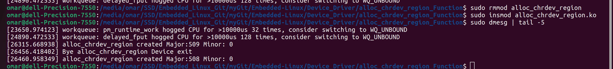

# alloc_chrdev_region & unregister_chrdev_region


## alloc_chrdev_region
The alloc_chrdev_region function in Linux is used to dynamically allocate a range of device numbers (major and minor numbers) for character devices. It allows you to reserve a specific range of device numbers for my driver.

```c
#include <linux/fs.h>

int alloc_chrdev_region(dev_t *dev, unsigned int firstminor, unsigned int count, const char *name);
```
- **dev:** Pointer to a variable of type dev_t where the allocated device numbers (major and minor) will be stored.
- **firstminor:** The starting minor number in the range to be allocated.
- **count:** The number of consecutive device numbers (major and minor combined) to allocate.
- **name:** The name of the device range. This is typically used for debugging purposes.


## unregister_chrdev_region
The unregister_chrdev_region function in Linux is used to unregister a range of device numbers (major and minor numbers) that were previously registered with register_chrdev_region or alloc_chrdev_region. It deallocates the specified range of device numbers, making them available for other drivers or kernel components.

```c
#include <linux/fs.h>

void unregister_chrdev_region(dev_t from, unsigned int count);
```
- **from:** The starting device number (major and minor combined) of the range to be unregistered.
- **count:** The number of consecutive device numbers (major and minor combined) to unregister.



