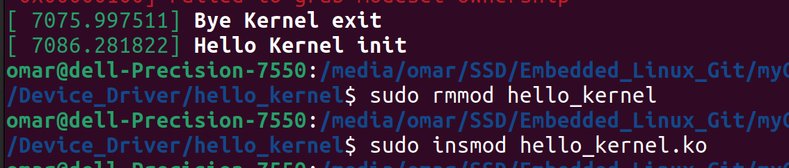

# Hello Kernel
```
a basic Linux kernel module that prints messages during initialization and exit,
providing a simple example of how to write and register module initialization and cleanup functions.
```
# Step To Make Kernel Module

## Header Files Inclusion:
```c
#include <linux/init.h>
#include <linux/module.h>
#include <linux/fs.h>
#include <linux/uaccess.h>
```
## Module Information:
```c
MODULE_LICENSE("GPL");
MODULE_AUTHOR("Omar Adel Shalaan");
MODULE_DESCRIPTION("A simple hello driver");
```
## Initialization and Exit Functions:
```c
static int __init hello_kernel_init(void)
{
    printk("Hello Kernel init\n"); // "\n" important to write
    return 0;
}

static void __exit hello_kernel_exit(void)
{
    printk("Bye Kernel exit\n"); // "\n" important to write 
}
```
- **hello_kernel_init:** This is the module's initialization function, called when the module is loaded into the kernel.
- **hello_kernel_exit:** This is the module's exit function, called when the module is unloaded from the kernel.

## Module Initialization and Cleanup Registration:
```c
module_init(hello_kernel_init);
module_exit(hello_kernel_exit);
```
- **module_init:** Registers the initialization function (hello_kernel_init) with the kernel, so it is called when the module is loaded.
- **module_exit:** Registers the exit function (hello_kernel_exit) with the kernel, so it is called when the module is unloaded.

## Then Do Make
```bash
$ make
```
Output **hello_kernel.ko**

## load Hello Kernel 
```bash
$ sudo insmod hello_kernel.ko 
```
## unload Hello Kernel 
```bash
$ sudo rmmod hello_kernel.ko 
```
## Print Kernel Message
```bash
$ sudo dmesg
```


# Raspberry Pi4 Hello Kernel

- add **hello_kernel.ko** and **Makefile** To Raspberry Pi4
- Then install headers in Raspberry Pi4
    ```bash
    sudo apt install raspberrypi-kernel-headers
    ```
- Run MakeFile
    ```bash
    make
    ```