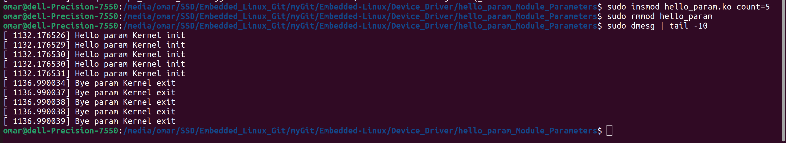
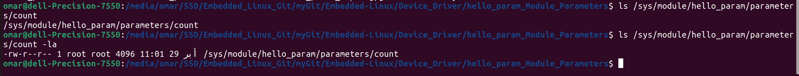
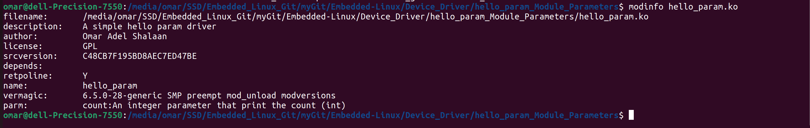

# Module Parameters

```c
int count = 0;
module_param(count, int, 0);
MODULE_PARM_DESC(count, "An integer parameter that print the count");
```

## module_param macro
The module_param macro is used to define module parameters. In this case, i am defining the count parameter as an integer (int) with default permissions (0). Default permissions mean that the parameter won't be exposed in the /sys/module/<module_name>/parameters/ directory, making it more of an internal variable.

## MODULE_PARM_DESC macro
The MODULE_PARM_DESC macro provides a description for the count module parameter. This description is helpful for users and developers to understand the purpose of the parameter. In this case, the description is "An integer parameter that prints the count.



## module parameter with specific permissions
```c
int count = 0;
//module_param(count, int, permission);
module_param(count, int, 0644);
MODULE_PARM_DESC(count, "An integer parameter that print the count");
```
## module_param(count, int, 0644)
In this case, I'm defining the count parameter as an integer (int) with permissions 0644. These permissions (0644) mean that the parameter is readable and writable by the owner (root) and readable by others.

can write that with param macros
```c
module_param(count, int, S_IRUGO | S_IWUSR);
//same 
module_param(count, int, 0644);
```

## the parameter macros
- **S_IRUSR (0444):** Read permission for the owner.
- **S_IWUSR (0200):** Write permission for the owner.
- **S_IXUSR (0100):** Execute permission for the owner.
- **S_IRGRP (0040):** Read permission for the group.
- **S_IWGRP (0020):** Write permission for the group.
- **S_IXGRP (0010):** Execute permission for the group.
- **S_IROTH (0004):** Read permission for others.
- **S_IWOTH (0002):** Write permission for others.
- **S_IXOTH (0001):** Execute permission for others.
- **S_IRUGO (0444):** Read permission for owner, group, and others (equivalent to S_IRUSR | S_IRGRP | S_IROTH).
- **S_IWUGO (0222):** Write permission for owner, group, and others (equivalent to S_IWUSR | S_IWGRP | S_IWOTH).

## modinfo 
    see the description associated with the count parameter.

    