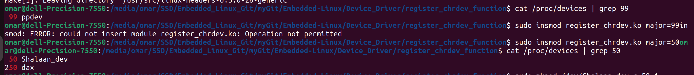
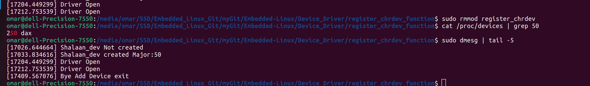
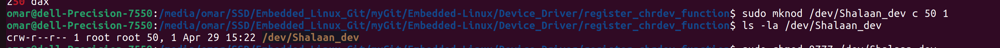
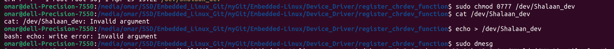

# register_chrdev & unregister_chrdev

The functions register_chrdev and unregister_chrdev are used in Linux kernel module programming to register and unregister character device drivers
```c
static inline int register_chrdev(unsigned int major, const char *name, const struct file_operations *fops);
static inline void unregister_chrdev(unsigned int major, const char *name)
```

## register_chrdev:
**Parameters:**
- **unsigned int major:** The major number to be assigned to the device. If 0 is provided, the kernel dynamically allocates a major number.
- **const char \*name:** The name of the device. This name is used to create device files in /dev.
- **const struct file_operations \*fops:** A pointer to a structure containing file operation function pointers for the device (e.g., open, read, write, etc.).
**Return Value:**
- If successful, returns 0 or a positive integer representing the allocated major number.
- On failure, returns a negative error code.

```c
static int __init Add_Device_init(void)
{
    //static inline int register_chrdev(unsigned int major, const char *name, const struct file_operations *fops)
    int retval = register_chrdev(major,"Shalaan_dev", &my_device_fops);
    if(retval == 0)
        printk("Shalaan_dev created Major:%d\n",major);
    else
    {
        printk("Shalaan_dev Not created\n");
        return -1;
    }
    return 0;
}
```



## unregister_chrdev:
**Parameters:**
- **unsigned int major:** The major number of the device to unregister.
- **const char *name:** The name of the device.
**Return Value:**
    No return value.

```c
static void __exit Add_Device_exit(void)
{
    // static inline void unregister_chrdev(unsigned int major, const char *name)
    unregister_chrdev(major , "Shalaan_dev");
    printk("Bye Add Device exit\n");
}
```




## struct file_operations
The struct file_operations in Linux kernel programming is a structure that defines various file operation function pointers for a device driver.

**driver_open Function:**
- This function is a **callback** function for the open operation of my character device driver.
It takes two arguments: **struct inode \*inode and struct file \*file**.
- The inode argument provides information about the file's inode (metadata), and the file argument represents the opened file descriptor.
- In my implementation, driver_open simply prints a message indicating that the driver has been opened.
**struct file_operations Initialization:**
struct file_operations is a structure that contains pointers to various file operation functions (e.g., open, read, write, release, etc.) that are implemented by the device driver.
In my code, i initialize my_device_fops with the .open field pointing to driver_open and set .owner to THIS_MODULE to manage the module's reference count.

```c
int driver_open (struct inode *driver_inode, struct file * driver_file)
{
    printk("Driver Open\n");
    return 0;
}

static struct file_operations my_device_fops = {
    // Define file operation functions such as open, read, write, etc.
    .open = driver_open,
    .owner = THIS_MODULE
};
```

### code's functionality:

- When the device file associated with my driver is opened, the driver_open function is called, and it logs a message indicating that the driver has been opened.
- Other file operation functions such as read, write, etc., can be similarly defined in struct file_operations to handle respective operations on my device.

## mknod Command
The mknod command in Linux is used to create special files, including device files, in the file system
```bash
$ sudo mknod /dev/Shalaan_dev c 50 0
```
- **/path/to/device_file: (dev/Shalaan_dev)** The path and name of the device file i want to create.
- **c:** Indicates that i are creating a character device file. For block devices, i would use b.
- **major: (50)** The major number of the device.
- **minor: (0)** The minor number of the device.



#### Try To callback file_operations function read and write


### remove Device 

