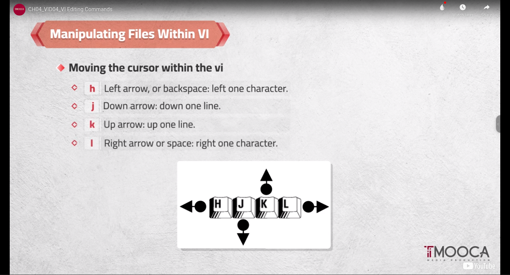
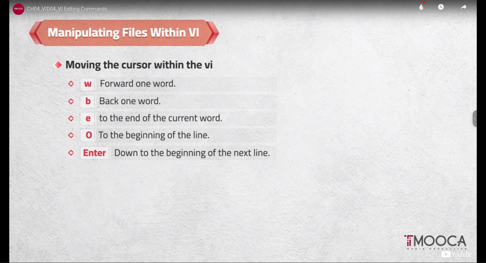
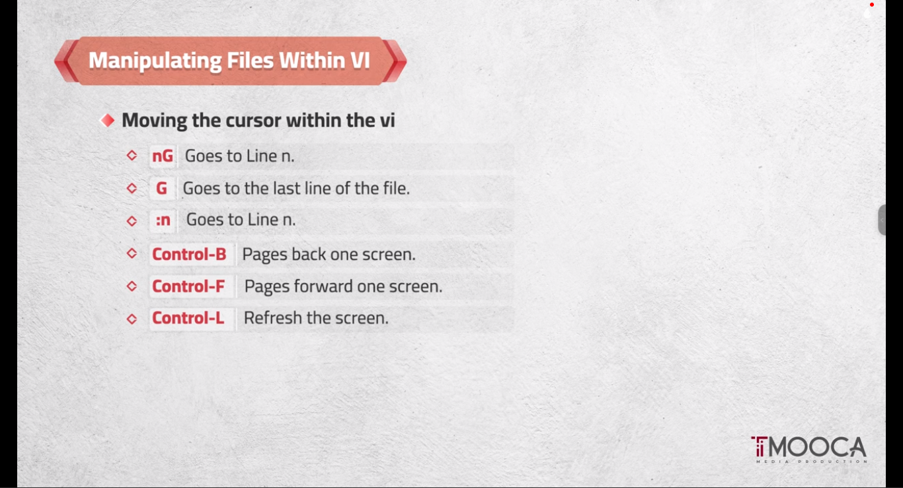
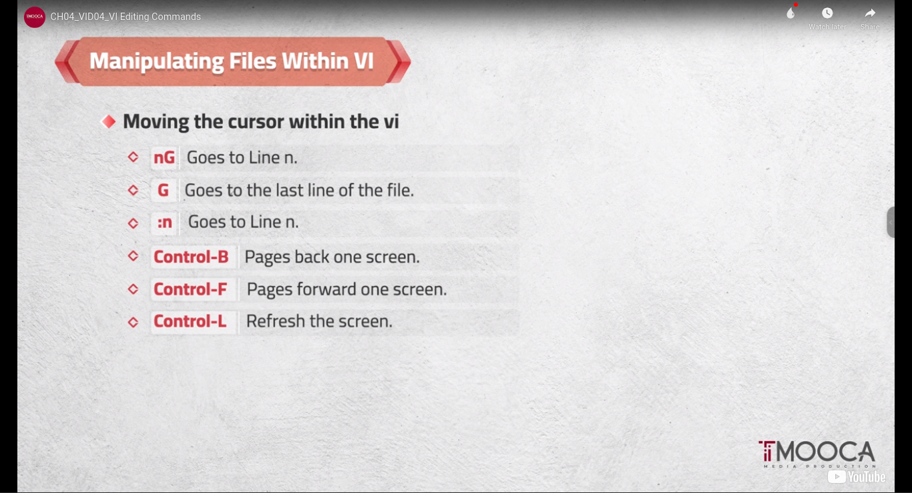
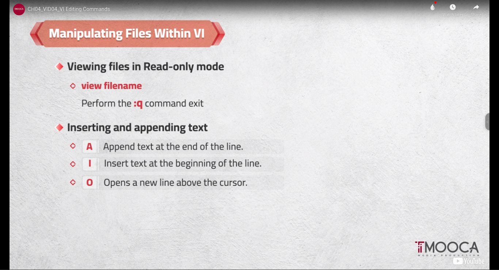
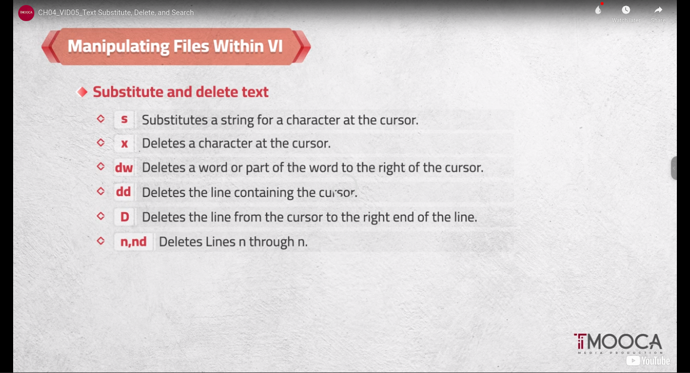
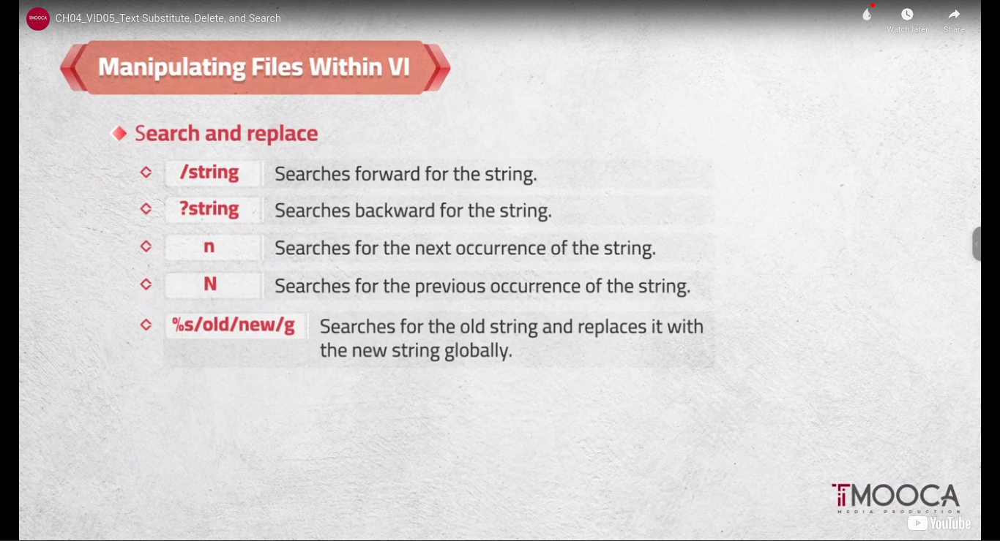
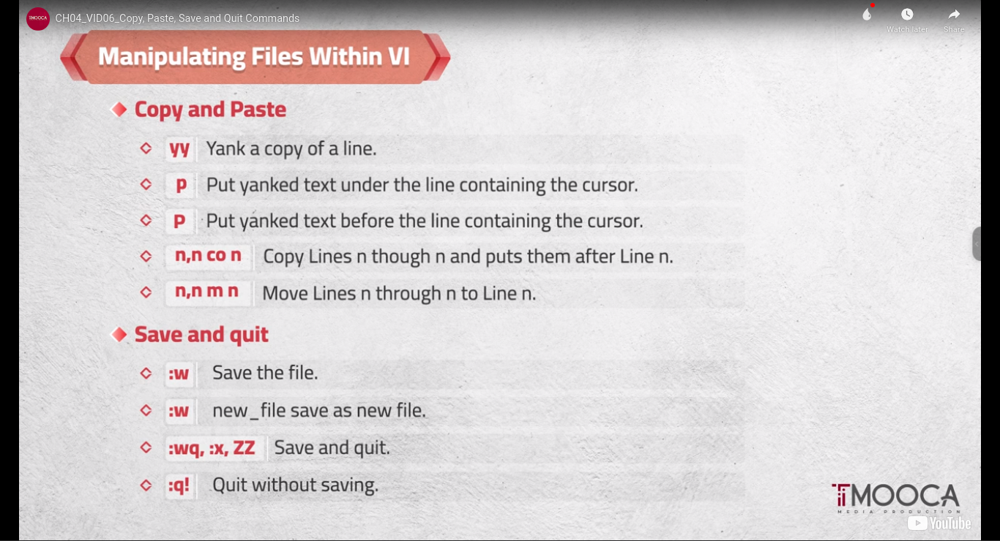
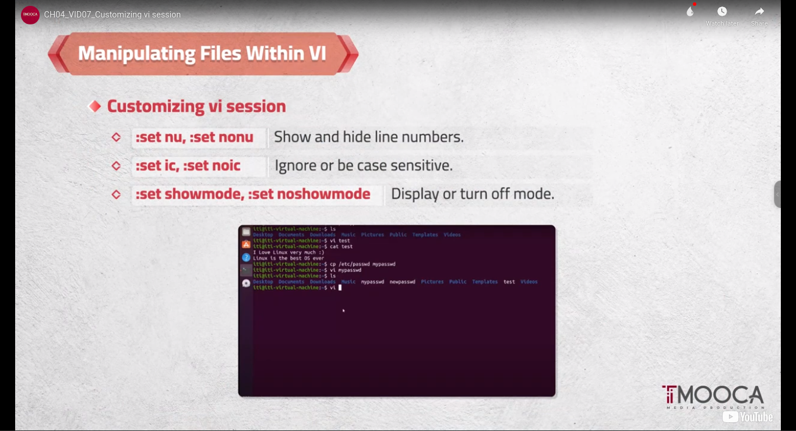

# Embedded Linux
## [My-Resume](https://github.com/OmarAdelShalaan/My-Resume) [Linkedin Profile](https://www.linkedin.com/in/omar-adel-shalaan/)

# Vim Editor

## Navigation Mode
-   H <==> L
-   K  ^  L
-   (yy) Copy Line
-   (vy) Select Copy Word
-   (p) Past Line
-   (/) Top To Bottom
-   (?) Bottom to Top
-   (n) next in search
-   (x) Delete Char
-   (dd) Delete Line

    
## Editing Mode  (i)
-   ESC To Change to Navigation Mode

## Command Mode (:)
-   (:wq) Write and Quit to save
-   (:q!) Force Quit not save      

### Editing Mode + (ESC) <==>  (i) + Navigation Mode + (:) <==> (ESC) Command Mode

## Mahara-Tech
## Ubuntu Linux Essentials

